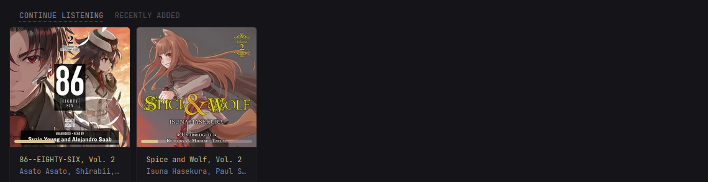
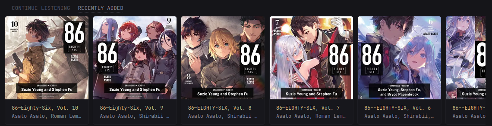
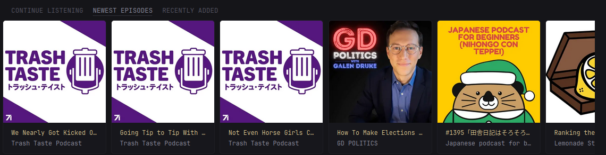
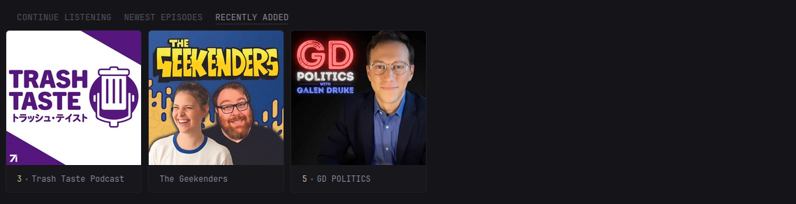

* [Introduction](#introduction)
* [Preview](#preview)
* [Environment Variables](#environment-variables)
* [Secrets](#secrets)
* [Options](#options)
* [Widget YAML](#widget-yaml)
* [🍻 Cheers](#cheers)

## Introduction
This is a widget for displaying a personalized dashboard from AudioBookshelf
showing personalized shelfs. It works for both audiobooks and podcasts and
supports the following shelfs:

* For Audiobooks
  1. `continue-listening` - A list of in-progress audiobooks to continue
     listening to.
  2. `continue-series` - Showing a list of the next book in the series (e.g.
     after finishing book 2 will show book 3, but is otherwise empty).
  3. `recently-added` - Showing a list of recently added audiobooks.
  4. `listen-again` - A list of the recently listened to audiobooks.
* For Podcasts
  1. `continue-listening` - Showing a list of in-progress podcast episodes.
  2. `newest-episodes` - Shows a list of recently added podcast episodes.
  3. `recently-added` - Shows a list of recently added series, and the number
     of new episodes available.
  4. `listen-again` - A list of the recently listened to podcast episodes.

If you encounter any issues, please open an issue, tag me, and I’ll investigate further.

Customisation can be applied using the `options:` field. See [Options](#options) for more details.

## Preview

### AudioBooks

### Continue Listening



### Recently Added



### Podcasts

### Continue Listening


### Newest Episodes



### Recently Added



## Environment Variables

> [!IMPORTANT]
>
> For URLs, you **MUST** include `http://` or `https://`.
> Do **NOT** include a trailing `/` at the end of URLs.

### AudioBookshelf
* `AUDIOBOOKSHELF_URL` - The AudioBookshelf URL, e.g., `http://<ip_address>:<port>` or `https://<domain>`
* `AUDIOBOOKSHELF_KEY` - The AudioBookshelf API key, available in `Settings` -> `API Keys`

## Secrets
Since `v0.8.0`, you can use Docker secrets instead of environment variables. See [v0.8.0 Release Notes](https://github.com/glanceapp/glance/releases/tag/v0.8.0#g-rh-5) for more information.
If you do, replace `${YOUR_API_KEY}` with `${secret:your-api-key-secret}`.

## Options
Since `v0.8.0`, you can use the `options:` field to customise the widget.
See [v0.8.0 Release Notes](https://github.com/glanceapp/glance/releases/tag/v0.8.0#g-rh-15) for more information.

> [!CAUTION]
>
> Enabling thumbnails **will** expose your token/API keys in the HTML.
> Do **not** enable this in production or on internet-exposed services.

  1. `continue-listening` - A list of in-progress audiobooks to continue
     listening to.
  2. `continue-series` - Showing a list of the next book in the series (e.g.
     after finishing book 2 will show book 3, but is otherwise empty).
  3. `recently-added` - Showing a list of recently added audiobooks.
  4. `listen-again` - A list of the recently listened to audiobooks.
* For Podcasts
  1. `continue-listening` - Showing a list of in-progress podcast episodes.
  2. `newest-episodes` - Shows a list of recently added podcast episodes.
  3. `recently-added` - Shows a list of recently added series, and the number
     of new episodes available.
  4. `listen-again` - A list of the recently listened to podcast episodes.

Default options are:
```yaml
options:
  # Required options
  base-url: ${AUDIOBOOKSHELF_URL} # Your environment-variables for the URL
  api-key: ${AUDIOBOOKSHELF_KEY}  # Your environment-variables for the API key/token. Can a secret as well `${secret:plex-token}`
  library: ""                     # Your AudioBookshelf library name.
  shelf: ""                       # The Shelf to display, one of 'continue-listening', 'continue-series', 'recently-added', 'listen-again', or 'newest-episodes'

  # Optional options
  small-column: false                     # `true` if using the widget in a small column
  show-thumbnail: false                   # `true` to show thumbnails
  progress-bar: true                      # `true` to display a progress bar (only applied in `continue-listening` or 'listen-again' mode)
  thumbnail-aspect-ratio: "default"       # see options below
```

* `thumbnail-aspect-ratio`:
    * `default`: original aspect ratio
    * `square`: aspect ratio of `1`
    * `portrait`: aspect ratio of `2/3`
    * `landscape`: aspect ratio of `16/9`

## Widget YAML
```yaml
- type: custom-api
  title: Listen Again
  frameless: true
  cache: 5m
  options:
    base-url: ${AUDIOBOOKSHELF_URL}
    api-key: ${AUDIOBOOKSHELF_KEY}
    library: "Podcasts"
    shelf: "continue-listening"
    small-column: false
    show-thumbnail: false
    thumbnail-aspect-ratio: "square"
  template: |
    {{/* Required config options */}}
    {{ $baseURL := .Options.StringOr "base-url" "" }}
    {{ $apiKey := .Options.StringOr "api-key" "" }}
    {{ $library := .Options.StringOr "library" "" }}
    {{ $shelf := .Options.StringOr "shelf" "" }}

    {{/* Optional config options */}}
    {{ $isSmallColumn:= .Options.BoolOr "small-column" false }}
    {{ $thumbAspectRatio := .Options.StringOr "thumbnail-aspect-ratio" "" }}
    {{ $showThumbnail := .Options.BoolOr "show-thumbnail" false }}
    {{ $showProgressBar := .Options.BoolOr "progress-bar" true }}

    {{/* Error message template */}}
    {{ define "errorMsg" }}
      <div class="widget-error-header">
        <div class="color-negative size-h3">ERROR</div>
        <svg class="widget-error-icon" xmlns="http://www.w3.org/2000/svg" fill="none" viewBox="0 0 24 24" stroke-width="1.5">
          <path stroke-linecap="round" stroke-linejoin="round" d="M12 9v3.75m-9.303 3.376c-.866 1.5.217 3.374 1.948 3.374h14.71c1.73 0 2.813-1.874 1.948-3.374L13.949 3.378c-.866-1.5-3.032-1.5-3.898 0L2.697 16.126ZM12 15.75h.007v.008H12v-.008Z"></path>
        </svg>
      </div>
      <p class="break-all">{{ . }}</p>
    {{ end }}

    {{/* Check required fields */}}
    {{ if or (eq $baseURL "") (eq $apiKey "") (eq $library "") (eq $shelf "") }}
      {{ template "errorMsg" "Some required options are not set." }}
    {{ else }}

      {{ $token := concat "Bearer " $apiKey }}

      {{ $librariesCall := newRequest (print $baseURL "/api/libraries")
          | withHeader "Authorization" $token
          | getResponse }}
      {{ $libraries := $librariesCall.JSON.Array "libraries" }}
      {{ $items := "" }}
      {{ range $libraries }}
        {{ $libraryName := .String "name" }}
        {{ if eq $libraryName $library }}
          {{ $libraryId := .String "id" }}

          {{ $personalizedViewCall := newRequest (print $baseURL "/api/libraries/" $libraryId "/personalized?include=rssfeed,numEpisodesIncomplete,share")
              | withHeader "Authorization" $token
              | getResponse }}
          {{ $shelfs := $personalizedViewCall.JSON.Array "" }}
          {{ range $shelfs }}
            {{ $shelfId := .String "id" }}
            {{ if eq $shelfId $shelf }}
              {{ $items = .Array "entities" }}
            {{ end }}
          {{ end }}
        {{ end }}
      {{ end }}

      {{ if eq (len $items) 0 }}
        <p>No items found, start streaming something!</p>
      {{ else }}
        {{/* Display the item carousel */}}
        <div class="carousel-container show-right-cutoff">
          <div class="cards-horizontal carousel-items-container">
            {{ range $n, $item := $items }}
              {{ $mediaType := $item.String "mediaType" }}

              {{ $itemID := $item.String "id" }}
              {{ $linkURL := print $baseURL "/audiobookshelf/item/" $itemID }}
              {{ $thumbURL := print $baseURL "/api/items/" $itemID "/cover?token=" $apiKey }}

              {{ $title := "" }}
              {{ $subtitle := "" }}
              {{ $newEpisodes := 0 }}

              {{ if eq $mediaType "book" }}
                {{ $title = $item.String "media.metadata.title" }}
                {{ $subtitle = $item.String "media.metadata.authorName" }}
              {{ else if eq $mediaType "podcast" }}
                {{ $title = $item.String "recentEpisode.title" }}
                {{ $subtitle = $item.String "media.metadata.title" }}
                {{ $newEpisodes = $item.Int "numEpisodesIncomplete" }}
              {{ end }}

              {{ $progressPercent := ""}}

              {{ if and $showThumbnail (or (eq $shelf "continue-listening" ) (eq $shelf "listen-again")) }}
                {{ if eq $mediaType "book" }}
                  {{ $getMediaProgressCall := newRequest (print $baseURL "/api/me/progress/" $itemID )
                      | withHeader "Authorization" $token
                      | getResponse }}
                  {{ $progress := $getMediaProgressCall.JSON.Float "progress" }}
                  {{ $progressPercent = printf "%f" (mul 100 $progress) }}
                {{ else if eq $mediaType "podcast" }}
                  {{ $libraryItemID := $item.String "recentEpisode.libraryItemId" }}
                  {{ $getMediaProgressCall := newRequest (print $baseURL "/api/me/progress/" $libraryItemID )
                      | withHeader "Authorization" $token
                      | getResponse }}
                  {{ $progress := $getMediaProgressCall.JSON.Float "progress" }}
                  {{ $progressPercent = printf "%f" (mul 100 $progress) }}
                {{ end }}
              {{ end }}

              <a class="card widget-content-frame" href="{{ $linkURL | safeURL }}">
                {{ if $showThumbnail }}
                  <div style="position: relative;">
                    

                    {{ if and ($showProgressBar) (not (eq $progressPercent "")) }}
                      <div style="
                        position: absolute;
                        bottom: 8px;
                        left: 8px;
                        right: 8px;
                        height: 6px;
                        border-radius: var(--border-radius);
                        overflow: hidden;
                        background-color: rgba(255, 255, 255, 0.2);
                      ">
                        <div style="
                          width: {{ print $progressPercent "%" }};
                          height: 100%;
                          border-radius: var(--border-radius) 0 0 var(--border-radius);
                          background-color: var(--color-primary)
                        "></div>
                      </div>
                    {{ end }}
                  </div>
                {{ end }}

                <div class="grow padding-inline-widget margin-top-10 margin-bottom-10">
                  <ul class="flex flex-column justify-evenly margin-bottom-3 {{ if $isSmallColumn }}size-h6{{ end }}" style="height: 100%;">
                    {{ if eq $newEpisodes 0 }}
                      <li class="color-primary text-truncate">{{ $title }}</li>
                      <li class="text-truncate">{{ $subtitle }}</li>
                    {{ else }}
                      <ul class="list-horizontal-text flex-nowrap">
                        <li class="color-primary shrink-0">{{ $newEpisodes }}</li>
                        <li class="text-truncate">{{ $subtitle }}</li>
                      </ul>
                    {{ end }}
                  </ul>
                </div>
              </a>
            {{ end }}
          </div>
        </div>
      {{ end }}
    {{ end }}
```

## 🍻 Cheers

* [titembaatar](https://github.com/titembaatar) - For the [Media Server
  History](https://github.com/glanceapp/community-widgets/tree/main/widgets/media-server-history)
  widget that much of this was based on.
