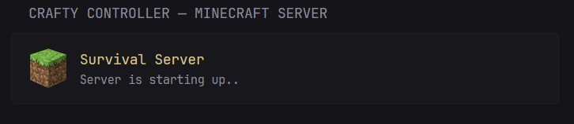
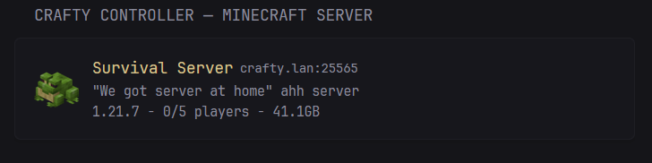
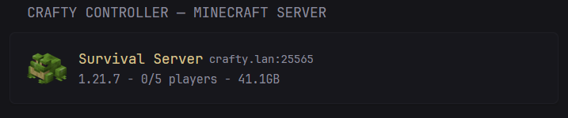

## Previews

#### When Server is offline:


#### When server is starting up:


#### When server is running:


Displays server's custom icon, inferred IP, MOTD message and some statistics. The display of MOTD can be disabled in the options section of the template, and the widget will look like this:



## Yaml
```yaml
- type: custom-api
  title: Crafty Controller - Minecraft Server
  cache: 5s
  options:
    base-url: ${CRAFTY_URL}
    api-key: ${CRAFTY_API_TOKEN}
    server-id: ${CRAFTY_SERVER_ID}
    display-MOTD: true
  allow-insecure: true
  template: |
    {{/* Required config options */}}
    {{ $baseURL := .Options.StringOr "base-url" "" }}
    {{ $apiKey := .Options.StringOr "api-key" "" }}
    {{ $serverID := .Options.StringOr "server-id" "" }}

    {{/* Optional config options */}}
    {{ $displayMOTD := .Options.BoolOr "display-MOTD" true }}

    {{ $serverStats := newRequest (print $baseURL "/api/v2/servers/" $serverID "/stats")
        | withHeader "Authorization" (print "Bearer " $apiKey)
        | withHeader "Accept" "application/json"
        | getResponse }}

    {{ $is_running :=  $serverStats.JSON.Bool "data.running" }}
    {{ $online_players :=  $serverStats.JSON.Int "data.online" | formatNumber }}
    {{ $max_players :=  $serverStats.JSON.Int "data.max" | formatNumber }}
    {{ $name :=  $serverStats.JSON.String "data.world_name" }}
    {{ $size :=  $serverStats.JSON.String "data.world_size" }}
    {{ $version :=  $serverStats.JSON.String "data.version" }}
    {{ $icon :=  $serverStats.JSON.String "data.icon" }}
    {{ $server_ip :=  $serverStats.JSON.String "data.server_id.server_ip" }}
    {{ $server_port :=  $serverStats.JSON.String "data.server_id.server_port" }}
    {{ $motd :=  $serverStats.JSON.String "data.desc" }}

    {{ $server_addr := "" }}
    {{ if and ($is_running) (eq $server_ip "127.0.0.1") }}
      {{ $server_addr = printf "%s:%s" (replaceMatches "https?://" "" $baseURL) $server_port }}
    {{ else if $is_running }}
      {{ $server_addr = printf "%s:%s" $server_ip $server_port }}
    {{ end }}

    {{ $starting := false }}
    {{ if and ($is_running) (eq $max_players "0") (eq $version "False") }}
      {{ $starting = true }}
    {{ end }}

    <!-- I couldn't find documentation describing the "waiting_start" state or the other booleans below. Implementation might not be correct. -->
    {{ $updating :=  $serverStats.JSON.Bool "data.updating" }}
    {{ $importing :=  $serverStats.JSON.Bool "data.importing" }}
    {{ $crashed :=  $serverStats.JSON.Bool "data.crashed" }}

    <div style="display:flex; align-items:center; gap:12px;">
      <!-- Server Icon -->
      <div style="width:40px; height:40px; flex-shrink:0; border-radius:4px; display:flex; justify-content:center; align-items:center; overflow:hidden;">
        {{ if eq $icon "" }}
          
        {{ else }}
          
        {{ end }}
      </div>

      <!-- Right side: Info -->
      <div style="display:flex; flex-direction:column;">
        <!-- First row: Server Name + IP -->
        <div style="display:flex; align-items:center; gap:6px;">
          <span class="size-h4 block text-truncate color-primary">
            {{ $name }}
          </span>

          {{ if and ($is_running) (not $starting) (not (eq $server_addr "")) }}
          <div style="font-size:0.9em; color:var(--color-secondary);">
            <span class="size-h6 color-secondary">
      	- {{ $server_addr }}
            </span>
          </div>
          {{ end }}
        </div>

        <!-- Second row: MOTD & Stats if server is running, otherwise show status msg  ... -->
        {{ if and ($is_running) (not $starting) }}
          {{ if and (not (eq $motd "")) ($displayMOTD) }}
            <div style="font-size:0.9em; color:var(--color-secondary);">
      	{{ replaceMatches "§." "" $motd }}
            </div>
          {{ end }}

          <div style="font-size:0.9em; color:var(--color-secondary);">
            {{ $version }} - {{ $online_players }}/{{ $max_players }} players - {{ $size }}
          </div>

        <!-- lots of assumptions about the boolean states meanings from crafty api.. -->
        {{ else if $starting }}
          <div style="font-size:0.9em; color:var(--color-secondary);">Server is starting up..</div>
        {{ else if $importing }}
          <div style="font-size:0.9em; color:var(--color-secondary);">Server is being imported..</div>
        {{ else if $updating }}
          <div style="font-size:0.9em; color:var(--color-secondary);">Server is being updated..</div>
        {{ else if $crashed }}
          <div style="font-size:0.9em; color:var(--color-secondary);">Server has crashed!</div>
        {{ else }}
          <div style="font-size:0.9em; color:var(--color-secondary);">Server is offline</div>
        {{ end }}
      </div>
    </div>
```

## Environment variables
- `CRAFTY_URL` - the URL or [IP]:[Port] to your Crafty Controller instance.
- `CRAFTY_SERVER_ID` - ID of the minecraft server you want to display info about. You can find it in the URL of the server details in Crafty Controller's dashboard. (Ex.; `https://[CRAFTY_URL]/panel/server_detail?id=[CRAFTY_SERVER_ID]`)
- `CRAFTY_API_TOKEN` - Your crafty API token. Requires `Full Access` permission.

## 🍻 Cheers

* @not-first as the author of [minecraft-server](/widgets/minecraft-server/README.md) community widget from which I took a lot of inspiration.
