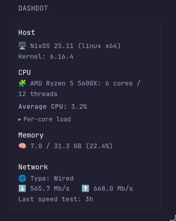

# Display System Information from [Dashdot](https://getdashdot.com/)



## Code
```yaml
- type: custom-api
  title: dashdot
  options:
    base-url: ${DASHDOT_URL}
    collapsible: true
  template: |
    {{ $base := .Options.StringOr "base-url" "" }}
    {{ $collapsible := .Options.BoolOr "collapsible" true }}

    {{/* Get static info */}}
    {{ $info := newRequest (concat $base "/info") | getResponse }}

    {{ if ne $info.Response.StatusCode 200 }}
      <p>Failed to fetch /info: {{ $info.Response.Status }}</p>
    {{ else }}
      {{ $ram := newRequest (concat $base "/load/ram") | getResponse }}
      {{ $cpu := newRequest (concat $base "/load/cpu") | getResponse }}

      <div class="size-h4 color-highlight">Host</div>
      <p class="margin-top-5">
        🖥️ {{ $info.JSON.String "os.distro" }} {{ $info.JSON.String "os.release" }}
        ({{ $info.JSON.String "os.platform" }} {{ $info.JSON.String "os.arch" }})
      </p>
      <p>Kernel: {{ $info.JSON.String "os.kernel" }}</p>

      <div class="size-h4 color-highlight margin-top-10">CPU</div>
      <p>
        🧩 {{ $info.JSON.String "cpu.brand" }} {{ $info.JSON.String "cpu.model" }}:
        {{ $info.JSON.Int "cpu.cores" }} cores / {{ $info.JSON.Int "cpu.threads" }} threads
      </p>

      {{ if eq $cpu.Response.StatusCode 200 }}
        {{ $cores := $cpu.JSON.Array "" }}
        {{ $total := 0.0 }}
        {{ range $cores }}{{ $total = add $total (.Float "load") }}{{ end }}
        {{ $count := len $cores }}
        {{ $avg := div $total (toFloat $count) }}
        <p class="margin-top-5"><strong>Average CPU:</strong> {{ printf "%.1f" $avg }}%</p>

        {{ if $collapsible }}
          <details class="margin-top-5">
            <summary class="size-h5 color-subtle" style="cursor:pointer;">Per-core load</summary>
            <div class="margin-top-5">
              {{ range $cores }}
                {{ $pct := .Float "load" }}
                <div class="margin-top-5">
                  <div class="flex justify-between">
                    <span class="color-subtle">Core {{ .Int "core" }}</span>
                    <span>{{ printf "%.1f" $pct }}%</span>
                  </div>
                  <div style="height:8px;background:var(--glance-bg2);border-radius:6px;overflow:hidden;">
                    <div style="height:8px;width:{{ printf "%.0f" $pct }}%;background:var(--glance-accent);"></div>
                  </div>
                </div>
              {{ end }}
            </div>
          </details>
        {{ else }}
          <div class="margin-top-5">
            {{ range $cores }}
              {{ $pct := .Float "load" }}
              <div class="margin-top-5">
                <div class="flex justify-between">
                  <span class="color-subtle">Core {{ .Int "core" }}</span>
                  <span>{{ printf "%.1f" $pct }}%</span>
                </div>
                <div style="height:8px;background:var(--glance-bg2);border-radius:6px;overflow:hidden;">
                  <div style="height:8px;width:{{ printf "%.0f" $pct }}%;background:var(--glance-accent);"></div>
                </div>
              </div>
            {{ end }}
          </div>
        {{ end }}
      {{ else }}
        <p>Failed to fetch /load/cpu: {{ $cpu.Response.Status }}</p>
      {{ end }}

      <div class="size-h4 color-highlight margin-top-10">Memory</div>
      {{ if eq $ram.Response.StatusCode 200 }}
        {{ $totalB := $info.JSON.Float "ram.size" }}
        {{ $usedB  := $ram.JSON.Float "load" }}
        {{ $pct    := mul (div $usedB $totalB) 100 }}
        {{ $usedGB := printf "%.1f" (div $usedB 1073741824) }}
        {{ $totGB  := printf "%.1f" (div $totalB 1073741824) }}
        <p>🧠 {{ $usedGB }} / {{ $totGB }} GB ({{ printf "%.1f" $pct }}%)</p>
        <div style="height:10px;background:var(--glance-bg2);border-radius:8px;overflow:hidden;">
          <div style="height:10px;width:{{ printf "%.1f" $pct }}%;background:var(--glance-accent);"></div>
        </div>
      {{ else }}
        <p>Failed to fetch /load/ram: {{ $ram.Response.Status }}</p>
      {{ end }}

      <div class="size-h4 color-highlight margin-top-10">Network</div>
      {{ $speedDown := printf "%.1f" (div ($info.JSON.Float "network.speedDown") 1000000) }}
      {{ $speedUp   := printf "%.1f" (div ($info.JSON.Float "network.speedUp")   1000000) }}
      {{ $unixSec   := printf "%.0f" (div ($info.JSON.Float "network.lastSpeedTest") 1000) }}
      <p>🌐 Type: {{ $info.JSON.String "network.type" }}</p>
      <p>⬇️ {{ $speedDown }} Mb/s &nbsp; ⬆️ {{ $speedUp }} Mb/s</p>
      <p>Last speed test: <span {{ $unixSec | parseTime "unix" | toRelativeTime }}></span></p>
    {{ end }}
```

## Environment variables

- `DASHDOT_URL` - the dashdot url (like `http://192.168.0.22:80`).

## Cores Expanded

