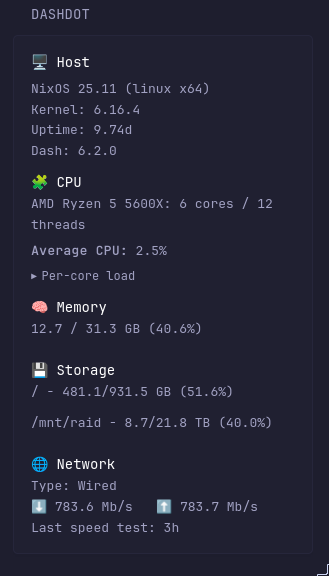
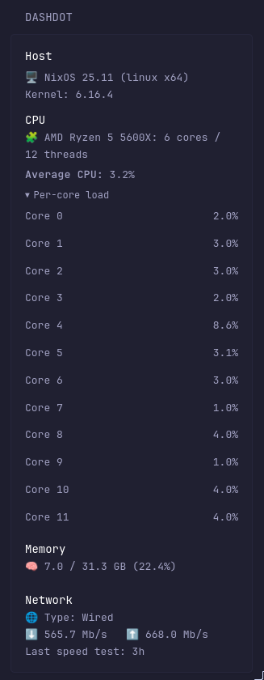

# Display System Information from [Dashdot](https://getdashdot.com/)



## Code
```yaml
- type: custom-api
  title: dashdot
  subrequests:
    info:
      url: ${DASHDOT_URL}/info
    cpu:
      url: ${DASHDOT_URL}/load/cpu
    ram:
      url: ${DASHDOT_URL}/load/ram
    storage:
      url: ${DASHDOT_URL}/load/storage
    config:
      url: ${DASHDOT_URL}/config
  options:
    collapsible: true
    memory-size-divisor: 1073741824
    memory-size-level: GB
    storage-label-switching: "default" # can be "default", "GB" or "TB" 
    show-host: true
    show-cpu: true
    show-ram: true
    show-storage: true
    show-network: true
  template: |
    {{ $info := .Subrequest "info" }}
    {{ $config  := .Subrequest "config" }}
    {{ $cpu := .Subrequest "cpu" }}
    {{ $ram := .Subrequest "ram" }}
    {{ $storage := .Subrequest "storage" }}

    {{ $collapsible := .Options.BoolOr "collapsible" true }}
    {{ $memorySizeDivisor := .Options.IntOr "memory-size-divisor" 1073741824 }}
    {{ $memorySizeLevel := .Options.StringOr "memory-size-level" "GB" }}            
    {{ $storageLabel := .Options.StringOr "storage-label-switching" "default" }}


    {{ if ne $info.Response.StatusCode 200 }}
      <p>Failed to fetch /info: {{ $info.Response.Status }}</p>
    {{ else }}

      {{ $showHost := .Options.BoolOr "show-host" true }}

      {{ if $showHost }}
        <div class="size-h4 color-highlight">🖥️ Host</div>
        <p class="margin-top-5">
          {{ $info.JSON.String "os.distro" }} {{ $info.JSON.String "os.release" }}
          ({{ $info.JSON.String "os.platform" }} {{ $info.JSON.String "os.arch" }})
        </p>
        <p>Kernel: {{ $info.JSON.String "os.kernel" }}</p>
        {{ $u := $info.JSON.Float "os.uptime" }}
        {{ if ge $u 86400.0 }}
          <p>Uptime: {{ printf "%.2f" (div $u 86400.0) }}d</p>
        {{ else }}
          <p>Uptime: {{ printf "%.2f" (div $u 3600.0) }}h</p>
        {{ end }}

        <p>Dash: {{ $info.JSON.String "os.dash_version"}} </p>
      {{ end }}

      {{ $showCPU := .Options.BoolOr "show-cpu" true }}

      {{ if $showCPU }}
        <div class="size-h4 color-highlight margin-top-10">🧩 CPU</div>
        <p>
          {{ $info.JSON.String "cpu.brand" }} {{ $info.JSON.String "cpu.model" }}:
          {{ $info.JSON.Int "cpu.cores" }} cores / {{ $info.JSON.Int "cpu.threads" }} threads
        </p>

        {{ if eq $cpu.Response.StatusCode 200 }}
          {{ $cores := $cpu.JSON.Array "" }}
          {{ $total := 0.0 }}
          {{ range $cores }}{{ $total = add $total (.Float "load") }}{{ end }}
          {{ $count := len $cores }}
          {{ $avg := div $total (toFloat $count) }}
          <p class="margin-top-5"><strong>Average CPU:</strong> {{ printf "%.1f" $avg }}%</p>

          {{ if $collapsible }}
            <details class="margin-top-5">
              <summary class="size-h5 color-subtle" style="cursor:pointer;">Per-core load</summary>
              <div class="margin-top-5">
                {{ range $cores }}
                  {{ $pct := .Float "load" }}
                  <div class="margin-top-5">
                    <div class="flex justify-between">
                      <span class="color-subtle">Core {{ .Int "core" }}</span>
                      <span>{{ printf "%.1f" $pct }}%</span>
                    </div>
                    <div style="height:8px;background:var(--glance-bg2);border-radius:6px;overflow:hidden;">
                      <div style="height:8px;width:{{ printf "%.0f" $pct }}%;background:var(--glance-accent);"></div>
                    </div>
                  </div>
                {{ end }}
              </div>
            </details>
          {{ else }}
            <div class="margin-top-5">
              {{ range $cores }}
                {{ $pct := .Float "load" }}
                <div class="margin-top-5">
                  <div class="flex justify-between">
                    <span class="color-subtle">Core {{ .Int "core" }}</span>
                    <span>{{ printf "%.1f" $pct }}%</span>
                  </div>
                  <div style="height:8px;background:var(--glance-bg2);border-radius:6px;overflow:hidden;">
                    <div style="height:8px;width:{{ printf "%.0f" $pct }}%;background:var(--glance-accent);"></div>
                  </div>
                </div>
              {{ end }}
            </div>
          {{ end }}
        {{ else }}
          <p>Failed to fetch /load/cpu: {{ $cpu.Response.Status }}</p>
        {{ end }}
      {{ end }}

      {{ $showRAM := .Options.BoolOr "show-ram" true }}
      {{ if $showRAM }}
        <div class="size-h4 color-highlight margin-top-10">🧠 Memory</div>
        {{ if eq $ram.Response.StatusCode 200 }}
          {{ $totalB := $info.JSON.Float "ram.size" }}
          {{ $usedB  := $ram.JSON.Float "load" }}
          {{ $pct    := mul (div $usedB $totalB) 100 }}
          {{ $usedGB := printf "%.1f" (div $usedB $memorySizeDivisor) }}
          {{ $totGB  := printf "%.1f" (div $totalB $memorySizeDivisor) }}
          <p>{{ $usedGB }} / {{ $totGB }} {{ $memorySizeLevel }} ({{ printf "%.1f" $pct }}%)</p>
          <div style="height:10px;background:var(--glance-bg2);border-radius:8px;overflow:hidden;">
            <div style="height:10px;width:{{ printf "%.1f" $pct }}%;background:var(--glance-accent);"></div>
          </div>
        {{ else }}
          <p>Failed to fetch /load/ram: {{ $ram.Response.Status }}</p>
        {{ end }}
      {{ end }}
      
      
      {{ $showStorage := .Options.BoolOr "show-storage" true }}

      {{ if $showStorage }}
        <div class="size-h4 color-highlight margin-top-10">💾 Storage</div>
        {{ if ne $storage.Response.StatusCode 200 }}
          <p>Failed to fetch /load/storage: {{ $storage.Response.Status }}</p>
        {{ else if ne $config.Response.StatusCode 200 }}
          <p>Failed to fetch /config: {{ $config.Response.Status }}</p>
        {{ else }}
          {{ $totalArr := $info.JSON.Array "storage" }}
          {{ $usedArr  := $storage.JSON.Array "" }}

          {{ range $i, $st := $totalArr }}
            {{ $disks := $st.Array "disks" }}
            {{ if gt (len $disks) 0 }}
              {{ $d := index $disks 0 }}
              {{ $dev := $d.String "device" }}

              {{/* Brand/type with overrides from /config */}}
              {{ $brand := $d.String "brand" }}
              {{ $brandKey := printf "config.override.storage_brands.%s" $dev }}
              {{ if $config.JSON.Exists $brandKey }}{{ $brand = $config.JSON.String $brandKey }}{{ end }}

              {{ $type := $d.String "type" }}
              {{ $typeKey := printf "config.override.storage_types.%s" $dev }}
              {{ if $config.JSON.Exists $typeKey }}{{ $type = $config.JSON.String $typeKey }}{{ end }}

              {{/* Totals/usage */}}
              {{ $totB  := $st.Float "size" }}
              {{ $usedJ := index $usedArr $i }}
              {{ $usedB := 0.0 }}
              {{ if $usedJ }}{{ $usedB = $usedJ.Float "" }}{{ end }}


              {{ $sizeDivisor := 0 }}
              {{ $sizeLevel   := "" }}

              {{ if eq $storageLabel "GB"}} 
                {{ $sizeDivisor = 1073741824.0 }}  {{/* GB (GiB bytes) */}}
                {{ $sizeLevel   = "GB" }}
              {{ else if eq $storageLabel "TB"}}
                {{ $sizeDivisor = 1099511627776.0 }}
                {{ $sizeLevel   = "TB" }}
              {{ else }}
                {{ $sizeDivisor = 1073741824.0 }}  {{/* GB (GiB bytes) */}}
                {{ $sizeLevel   = "GB" }}
                {{ $totGB := div $totB 1073741824.0 }}
                {{ if ge $totGB 1000.0 }}
                  {{ $sizeDivisor = 1099511627776.0 }} {{/* TB (TiB bytes) */}}
                  {{ $sizeLevel   = "TB" }}
                {{ end }}
              {{ end }}

              {{ $pct    := mul (div $usedB $totB) 100 }}
              {{ $usedFmt := printf "%.1f" (div $usedB $sizeDivisor) }}
              {{ $totFmt  := printf "%.1f" (div $totB  $sizeDivisor) }}

              <p>{{ $brand }} {{ $type }} - {{ $usedFmt }}/{{ $totFmt }} {{ $sizeLevel }} ({{ printf "%.1f" $pct }}%)</p>
              <div style="height:10px;background:var(--glance-bg2);border-radius:8px;overflow:hidden;">
                <div style="height:10px;width:{{ printf "%.1f" $pct }}%;background:var(--glance-accent);"></div>
              </div>
            {{ end }}
          {{ end }}
        {{ end }}
      {{ end }}

      {{ $showNetwork := .Options.BoolOr "show-network" true }}
      
      {{ if $showNetwork }}
        <div class="size-h4 color-highlight margin-top-10">🌐 Network</div>
        {{ $speedDown := printf "%.1f" (div ($info.JSON.Float "network.speedDown") 1000000) }}
        {{ $speedUp   := printf "%.1f" (div ($info.JSON.Float "network.speedUp")   1000000) }}
        {{ $unixSec   := printf "%.0f" (div ($info.JSON.Float "network.lastSpeedTest") 1000) }}
        <p>Type: {{ $info.JSON.String "network.type" }}</p>
        <p>⬇️ {{ $speedDown }} Mb/s &nbsp; ⬆️ {{ $speedUp }} Mb/s</p>
        <p>Last speed test: <span {{ $unixSec | parseTime "unix" | toRelativeTime }}></span></p>
      {{ end }}
    {{ end }}
```

## Environment variables

- `DASHDOT_URL` - the dashdot url (like `http://192.168.0.22:80`).

## Cores Expanded

