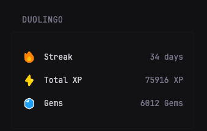

# Duolingo Stats

Display your Duolingo learning progress directly in Glance, including streak, XP, gems, and course information.

## Introduction

This widget provides a quick overview of your Duolingo statistics without needing to open the app or website. It displays your current streak, total XP, gems, and enrolled courses in a clean, organized layout that matches Glance's aesthetic.

If you encounter any issues, please open an issue and tag me (@RealTong) - I'll investigate further.

## Preview



## Environment Variables

> [!IMPORTANT]
>
> You must obtain your Duolingo user ID and JWT token for authentication.
> These values are required for the widget to function properly.

* `DUO_USER_ID` - Your Duolingo user ID (e.g., `1234567890`)
* `DUO_JWT_TOKEN` - Your Duolingo JWT authentication token

### Getting Your Credentials

To obtain your Duolingo credentials:

1. **User ID**: Log into Duolingo web, open developer tools (F12), go to Network tab, and look for API calls containing your user ID
2. **JWT Token**: In the same developer tools, find the `Authorization` header in any API request (starts with `Bearer`)

> [!NOTE]
> The JWT token has a very long expiration time, but you may need to update it occasionally if the widget stops working.

## Widget YAML

```yaml
- type: custom-api
  title: Duolingo Stats
  cache: 1h
  url: https://www.duolingo.com/2023-05-23/users/${DUO_USER_ID}?fields=id,name,username,learningLanguage,creationDate,totalXp,gemsConfig,hasPlus,xpGoal,streak,email,fromLanguage,currentCourseId,lastResurrectionTimestamp,courses
  headers:
    Authorization: Bearer ${DUO_JWT_TOKEN}
  template: |
    <ul class="list list-gap-14 collapsible-container">
      <li class="separator margin-top-10 margin-bottom-10"></li>
      
      <li class="flex items-center gap-12">
        <div class="flex items-center justify-center shrink-0" style="width: 24px; height: 24px;">
          <svg width="20" height="20" viewBox="0 0 16 20" fill="none" xmlns="http://www.w3.org/2000/svg">
            <path d="M6.77271 0.532617C7.336 -0.177539 8.414 -0.177539 8.97729 0.532616L14.0623 6.94342C15.1193 8.23421 15.75 9.86374 15.75 11.6351C15.75 15.8233 12.2242 19.2185 7.875 19.2185C3.52576 19.2185 0 15.8233 0 11.6351C0 11.3414 0.0173457 11.0515 0.0511046 10.7664L0.0333507 4.37841C0.0307386 3.43858 0.542464 2.74527 1.41725 2.89269C1.59157 2.92207 1.9601 3.0331 2.12522 3.12149L3.94611 4.09617L6.77271 0.532617Z" fill="#FF9600"/>
            <path d="M8.40677 8.24144C8.1299 7.86443 7.5667 7.86443 7.28982 8.24144L5.30202 10.9482C5.28343 10.9735 5.2689 11 5.25814 11.027C4.7842 11.5866 4.5 12.3011 4.5 13.0796C4.5 14.8745 6.01104 16.3296 7.875 16.3296C9.73896 16.3296 11.25 14.8745 11.25 13.0796C11.25 12.2008 10.8878 11.4035 10.2993 10.8185L8.40677 8.24144Z" fill="#FFC800"/>
          </svg>
        </div>
        <span class="color-highlight text-truncate block grow font-medium" style="line-height: 24px;">Streak</span>
        <span class="font-bold text-large color-warning" style="line-height: 24px;">{{ .JSON.Int "streak" }} days</span>
      </li>
      
      <li class="flex items-center gap-12">
        <div class="flex items-center justify-center shrink-0" style="width: 24px; height: 24px;">
          <svg width="20" height="20" viewBox="0 0 22 30" fill="none" xmlns="http://www.w3.org/2000/svg">
            <path fill-rule="evenodd" clip-rule="evenodd" d="M14.0367 2.67272C13.8379 0.718003 11.3282 0.0455378 10.1787 1.63898L0.717665 14.7538C-0.157342 15.9667 0.452676 17.6801 1.89732 18.0672L7.2794 19.5093L8.07445 27.3273C8.27323 29.282 10.7829 29.9545 11.9324 28.361L21.3935 15.2462C22.2685 14.0333 21.6585 12.3199 20.2138 11.9328L14.8317 10.4907L14.0367 2.67272Z" fill="#FFD900"/>
            <path d="M2.574 16.4882C2.08457 16.3561 2.03731 15.6803 2.50359 15.4813L6.24415 13.8853C6.58188 13.7412 6.96093 13.973 6.98654 14.3393L7.17226 16.9952C7.19787 17.3615 6.85477 17.6438 6.50027 17.5481L2.574 16.4882Z" fill="#F7C100"/>
            <path d="M19.717 13.2505C20.2064 13.3826 20.2537 14.0584 19.7874 14.2573L16.0469 15.8533C15.7091 15.9974 15.3301 15.7656 15.3045 15.3993L15.1188 12.7435C15.0931 12.3772 15.4362 12.0949 15.7907 12.1906L19.717 13.2505Z" fill="#FFEF8F"/>
          </svg>
        </div>
        <span class="color-highlight text-truncate block grow font-medium" style="line-height: 24px;">Total XP</span>
        <span class="font-bold text-large" style="line-height: 24px;">{{ .JSON.Int "totalXp" }} XP</span>
      </li>
      
      <li class="flex items-center gap-12">
        <div class="flex items-center justify-center shrink-0" style="width: 24px; height: 24px;">
          <svg width="20" height="20" viewBox="0 0 24 30" fill="none" xmlns="http://www.w3.org/2000/svg">
            <path d="M3.12035 6.45972C1.80438 7.25391 1 8.67887 1 10.2159V19.8822C1 21.4192 1.80438 22.8442 3.12035 23.6384L9.59501 27.5458C10.9891 28.3872 12.7345 28.3872 14.1287 27.5459L20.6037 23.6384C21.9197 22.8442 22.7241 21.4192 22.7241 19.8821V10.216C22.7241 8.67889 21.9197 7.2539 20.6037 6.45972L14.1287 2.55221C12.7345 1.71089 10.9891 1.71091 9.59501 2.55226L3.12035 6.45972Z" fill="#1CB0F6" stroke="white" stroke-width="2"/>
            <path fill-rule="evenodd" clip-rule="evenodd" d="M10.2449 5.45314C10.9645 5.01112 11.8902 5.52889 11.8902 6.37339V9.53852C11.8902 9.91649 11.6926 10.267 11.3692 10.4626L8.42194 12.2455C8.05585 12.4669 7.59354 12.4514 7.24315 12.2058L4.85711 10.5338C4.22068 10.0878 4.24944 9.13584 4.91163 8.7291L10.2449 5.45314Z" fill="#DDF4FF"/>
          </svg>
        </div>
        <span class="color-highlight text-truncate block grow font-medium" style="line-height: 24px;">Gems</span>
        <span class="font-bold color-info" style="line-height: 24px;">{{ .JSON.Int "gemsConfig.gems" }} Gems</span>
      </li>
      
      <li class="separator margin-top-10 margin-bottom-10"></li>
      
      <li class="collapsible-item">
        <details>
          <summary class="flex items-center gap-12 cursor-pointer">
            <span class="color-highlight text-truncate block grow font-medium">My Courses</span>
            <span class="text-muted">{{ .JSON.Array "courses" | len }} courses</span>
          </summary>
          <ul class="list list-gap-10 margin-top-14">
            {{ range .JSON.Array "courses" }}
              <li class="flex items-center gap-12 padding-left-24">
                <span class="text-truncate block grow">
                  <span class="font-medium">
                    {{ if .String "title" }}
                      {{ .String "title" }}
                    {{ else }}
                      {{ if eq (.String "subject") "math" }}
                        Mathematics
                      {{ else if eq (.String "subject") "music" }}
                        Music Theory
                      {{ else if eq (.String "subject") "chess" }}
                        Chess
                      {{ else }}
                        {{ .String "subject" }}
                      {{ end }}
                    {{ end }}
                  </span>
                  <span class="text-muted text-small block">{{ .String "topic" }}</span>
                </span>
                <span class="text-right">
                  <span class="font-bold">{{ .Int "xp" }}</span>
                  <span class="text-muted text-small block">XP</span>
                </span>
              </li>
            {{ end }}
          </ul>
        </details>
      </li>
    </ul>
```