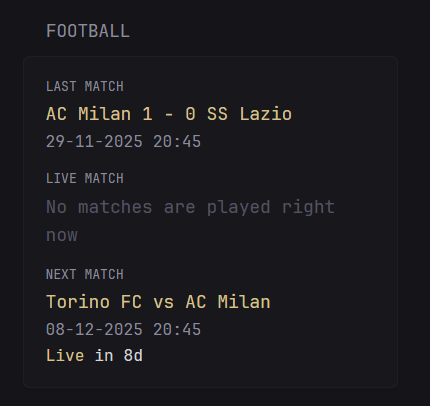

```yaml
        - type: custom-api
          title: Football
          cache: 30m

          url: https://api.football-data.org/v4/teams/TEAM_ID/matches?status=SCHEDULED,IN_PLAY,FINISHED

          headers:
            X-Auth-Token: FOOTBALL_DATA_TOKEN

          template: |
            <div class="football-fixtures">

              {{ $jsonData := .JSON }}
              {{ $matches := $jsonData.Array "matches" }}
              {{ $matchCount := len $matches }}

              {{/* --- Last Match --- */}}
              <div style="margin-bottom: 12px;">
                <div style="font-size: 0.8em; margin-bottom: 2px; text-transform: uppercase;">Last Match</div>
                {{ $lastFound := false }}
                {{ $lastHomeTeam := "N/A" }}
                {{ $lastAwayTeam := "N/A" }}
                {{ $lastHomeScore := "?" }}
                {{ $lastAwayScore := "?" }}
                {{ $lastDate := "N/A" }}

                {{ range $matches }}
                  {{ $matchData := .Value }} {{/* Get underlying map/object */}}
                  {{ $status := index $matchData "status" }}
                  {{ if and $status (eq ($status | printf "%s") "FINISHED") }}
                    {{ $lastFound = true }}

                    {{ $homeTeamObj := index $matchData "homeTeam" }}
                    {{ $awayTeamObj := index $matchData "awayTeam" }}
                    {{ if $homeTeamObj }}{{ $lastHomeTeam = index $homeTeamObj "name" | printf "%s" }}{{ else }}{{ $lastHomeTeam = "N/A" }}{{ end }}
                    {{ if $awayTeamObj }}{{ $lastAwayTeam = index $awayTeamObj "name" | printf "%s" }}{{ else }}{{ $lastAwayTeam = "N/A" }}{{ end }}

                    {{ $lastHomeScore = "?" }} {{/* Default */}}
                    {{ $lastAwayScore = "?" }} {{/* Default */}}
                    {{ $scoreObj := index $matchData "score" }}
                    {{ if $scoreObj }}
                      {{ $fullTimeObj := index $scoreObj "fullTime" }}
                      {{ if $fullTimeObj }}
                        {{ $homeScoreVal := index $fullTimeObj "home" }}
                        {{ $awayScoreVal := index $fullTimeObj "away" }}
                        {{/* Check if score value is not nil before formatting */}}
                        {{ if ne $homeScoreVal nil }} {{/* Check for not nil */}}
                            {{ $lastHomeScore = $homeScoreVal | printf "%.0f" }}
                        {{ else }}
                            {{ $lastHomeScore = "?" }}
                        {{ end }}
                        {{ if ne $awayScoreVal nil }} {{/* Check for not nil */}}
                            {{ $lastAwayScore = $awayScoreVal | printf "%.0f" }}
                        {{ else }}
                            {{ $lastAwayScore = "?" }}
                        {{ end }}
                      {{ end }}
                    {{ end }}

                    {{ $dateVal := index $matchData "utcDate" }}
                    {{ if $dateVal }}{{ $lastDate = $dateVal | printf "%s" }}{{ else }}{{ $lastDate = "N/A" }}{{ end }}
                  {{ end }}
                {{ end }}

                {{/* --- Display Last Match --- */}}
                {{ if $lastFound }}
                  <div class="color-primary" style="font-size: 1.1em;">
                    {{ $lastHomeTeam }} {{ $lastHomeScore }} - {{ $lastAwayScore }} {{ $lastAwayTeam }}
                  </div>
                  {{ $dateStr := $lastDate }}
                  {{ if and $dateStr (ne $dateStr "N/A") (ge (len $dateStr) 16) }}
                    {{ $year := slice $dateStr 0 4 }}
                    {{ $month := slice $dateStr 5 7 }}
                    {{ $day := slice $dateStr 8 10 }}
                    {{ $hour := slice $dateStr 11 13 }}
                    {{ $minute := slice $dateStr 14 16 }}
                    {{ $timedhour := slice $dateStr 11 13 }}
                    {{/*Adjust the time to the one that reflects yours timezone. Delete/Add if you need*/}}
                    {{ if eq $hour "11" }}{{ $timedhour = "12" }}{{ end }} {{/* Eg. a match in my timezone start at 12. But in UTC time is 11. Ik is very rudimental but I can't find other solution */}}
                    {{ if eq $hour "14" }}{{ $timedhour = "15" }}{{ end }}
                    {{ if eq $hour "17" }}{{ $timedhour = "18" }}{{ end }}
                    {{ if eq $hour "19" }}{{ $timedhour = "20" }}{{ end }}
                    {{ if eq $hour "20" }}{{ $timedhour = "21" }}{{ end }}
                    <div style="font-size: 13px;">
                      {{ $day }}-{{ $month }}-{{ $year }} {{ $timedhour }}:{{ $minute }}
                    </div>
                  {{ else if $dateStr }}
                    {{/* Fallback if date string is not in expected format */}}
                    <div class="color-subdue" style="font-size: 13px">{{ $dateStr }}</div>
                  {{ end }}
                {{ else }}
                  <div class="color-subdue" style="font-size: 1.1em;">No finished matches found</div>
                {{ end }}
              </div>

              {{/* --- Live Match --- */}}
              <div style="margin-bottom: 12px;">
                <div style="font-size: 0.8em; margin-bottom: 2px; text-transform: uppercase;">Live Match</div>
                {{ $liveFound := false }}
                {{ $liveHomeTeam := "N/A" }}
                {{ $liveAwayTeam := "N/A" }}
                {{ $liveHomeScore := "?" }}
                {{ $liveAwayScore := "?" }}
                {{ $liveDate := "N/A" }}

                {{ range $matches }}
                  {{ $matchData := .Value }} {{/* Get underlying map/object */}}
                  {{ $status := index $matchData "status" }}
                  {{ if and $status (eq ($status | printf "%s") "IN_PLAY") }}
                    {{ $liveFound = true }}
                    {{ $homeTeamObj := index $matchData "homeTeam" }}
                    {{ $awayTeamObj := index $matchData "awayTeam" }}
                    {{ if $homeTeamObj }}{{ $liveHomeTeam = index $homeTeamObj "name" | printf "%s" }}{{ else }}{{ $liveHomeTeam = "N/A" }}{{ end }}
                    {{ if $awayTeamObj }}{{ $liveAwayTeam = index $awayTeamObj "name" | printf "%s" }}{{ else }}{{ $liveAwayTeam = "N/A" }}{{ end }}
                    {{ $liveHomeScore = "?" }} {{/* Default */}}
                    {{ $liveAwayScore = "?" }} {{/* Default */}}
                    {{ $scoreObj := index $matchData "score" }}
                    {{ if $scoreObj }}
                      {{ $fullTimeObj := index $scoreObj "fullTime" }}
                      {{ if $fullTimeObj }}
                        {{ $homeScoreVal := index $fullTimeObj "home" }}
                        {{ $awayScoreVal := index $fullTimeObj "away" }}
                        {{/* Check if score value is not nil before formatting */}}
                        {{ if ne $homeScoreVal nil }} {{/* Check for not nil */}}
                            {{ $liveHomeScore = $homeScoreVal | printf "%.0f" }}
                        {{ else }}
                            {{ $liveHomeScore = "?" }}
                        {{ end }}
                        {{ if ne $awayScoreVal nil }} {{/* Check for not nil */}}
                            {{ $liveAwayScore = $awayScoreVal | printf "%.0f" }}
                        {{ else }}
                            {{ $liveAwayScore = "?" }}
                        {{ end }}
                      {{ end }}
                    {{ end }}

                    {{ $dateVal := index $matchData "utcDate" }}
                    {{ if $dateVal }}{{ $liveDate = $dateVal | printf "%s" }}{{ else }}{{ $liveDate = "N/A" }}{{ end }}
                  {{ end }}
                {{ end }}

                {{/* --- Display Live Match --- */}}
                {{ if $liveFound }}
                  <div class="color-primary" style="font-size: 1.1em;">
                    {{ if eq $liveHomeTeam "FC Internazionale Milano" }}{{ $liveHomeTeam = "Inter FC" }}{{ end }}
                    {{ if eq $liveAwayTeam "FC Internazionale Milano" }}{{ $liveHomeTeam = "Inter FC" }}{{ end }}
                    {{ $liveHomeTeam }} {{ $liveHomeScore }} - {{ $liveAwayScore }} {{ $liveAwayTeam }}
                  </div>
                  {{ $dateStr := $liveDate }}
                  {{ if and $dateStr (ne $dateStr "N/A") (ge (len $dateStr) 16) }}
                    {{ $year := slice $dateStr 0 4 }}
                    {{ $month := slice $dateStr 5 7 }}
                    {{ $day := slice $dateStr 8 10 }}
                    {{ $hour := slice $dateStr 11 13 }}
                    {{ $minute := slice $dateStr 14 16 }}
                    {{ $timedhour := slice $dateStr 11 13 }}
                    {{/*Adjust the time to the one that reflects yours timezone. Delete/Add if you need*/}}
                    {{ if eq $hour "11" }}{{ $timedhour = "12" }}{{ end }} {{/* Eg. a match in my timezone start at 12. But in UTC time is 11. Ik is very rudimental but i can't find other solution */}}
                    {{ if eq $hour "14" }}{{ $timedhour = "15" }}{{ end }}
                    {{ if eq $hour "17" }}{{ $timedhour = "18" }}{{ end }}
                    {{ if eq $hour "19" }}{{ $timedhour = "20" }}{{ end }}
                    {{ if eq $hour "20" }}{{ $timedhour = "21" }}{{ end }}
                    <div style="font-size: 13px;">
                      <p class="color-highlight">
                        <span>Live, started</span>
                        {{ $datetime := $dateStr}}
                        <span
                          class="color-highlight"
                          title="{{ $dateStr }}"
                          {{ parseRelativeTime "rfc3339" $datetime }}
                        ></span><span class="color-highlight"> ago</span>
                      </p>
                    </div>
                  {{ else if $dateStr }}
                    {{/* Fallback if date string is not in expected format */}}
                    <div class="color-subdue" style="font-size: 13px">{{ $dateStr }}</div>
                  {{ end }}
                {{ else }}
                  <div class="color-subdue" style="font-size: 1.1em;">No matches are played right now</div>
                {{ end }}
              </div>

              {{/* --- Next Match --- */}}
              <div>
                <div style="font-size: 0.8em; margin-bottom: 2px; text-transform: uppercase;">Next Match</div>
                {{ $nextFound := false }}
                {{ $nextHomeTeam := "N/A" }}
                {{ $nextAwayTeam := "N/A" }}
                {{ $nextDate := "N/A" }}
                {{ range $matches }}
                  {{ $matchData := .Value }}
                  {{ if not $nextFound }}
                    {{ $status := index $matchData "status" }}
                    {{ if $status }}
                      {{ $statusStr := $status | printf "%s" }}
                      {{/* The API might use TIMED or SCHEDULED for upcoming */}}
                      {{ if or (eq $statusStr "SCHEDULED") (eq $statusStr "TIMED") }}
                        {{ $nextFound = true }}
                        {{ $homeTeamObj := index $matchData "homeTeam" }}
                        {{ $awayTeamObj := index $matchData "awayTeam" }}
                        {{ if $homeTeamObj }}{{ $nextHomeTeam = index $homeTeamObj "name" | printf "%s" }}{{ else }}{{ $nextHomeTeam = "N/A" }}{{ end }}
                        {{ if $awayTeamObj }}{{ $nextAwayTeam = index $awayTeamObj "name" | printf "%s" }}{{ else }}{{ $nextAwayTeam = "N/A" }}{{ end }}
                        {{ $dateVal := index $matchData "utcDate" }}
                        {{ if $dateVal }}{{ $nextDate = $dateVal | printf "%s" }}{{ else }}{{ $nextDate = "N/A" }}{{ end }}
                      {{ end }}
                    {{ end }}
                  {{ end }}
                {{ end }}

                {{/* --- Display Next Match --- */}}
                {{ if $nextFound }}
                  <div class="color-primary" style="font-size: 1.1em;">
                    {{ if eq $lastHomeTeam "FC Internazionale Milano" }}{{ $lastHomeTeam = "Inter FC" }}{{ end }}
                    {{ if eq $lastAwayTeam "FC Internazionale Milano" }}{{ $lastHomeTeam = "Inter FC" }}{{ end }}
                    {{ $nextHomeTeam }} vs {{ $nextAwayTeam }}
                  </div>
                  {{ $dateStr := $nextDate }}
                  {{ if and $dateStr (ne $dateStr "N/A") (ge (len $dateStr) 16) }}
                    {{ $year := slice $dateStr 0 4 }}
                    {{ $month := slice $dateStr 5 7 }}
                    {{ $day := slice $dateStr 8 10 }}
                    {{ $hour := slice $dateStr 11 13 }}
                    {{ $minute := slice $dateStr 14 16 }}
                    {{ $timedhour := slice $dateStr 11 13 }}
                    {{/*Adjust the time to the one that reflects yours timezone. Delete/Add if you need*/}}
                    {{ if eq $hour "11" }}{{ $timedhour = "12" }}{{ end }} {{/* Eg. a match in my timezone start at 12. But in UTC time is 11. Ik is very rudimental but i can't find other solution */}}
                    {{ if eq $hour "14" }}{{ $timedhour = "15" }}{{ end }}
                    {{ if eq $hour "17" }}{{ $timedhour = "18" }}{{ end }}
                    {{ if eq $hour "19" }}{{ $timedhour = "20" }}{{ end }}
                    {{ if eq $hour "20" }}{{ $timedhour = "21" }}{{ end }}
                    <div style="font-size: 13px;">
                      {{ $day }}-{{ $month }}-{{ $year }} {{ $timedhour }}:{{ $minute }}
                      <p class="color-primary">
                        <span>Live</span>
                        {{ $datetime := $dateStr}}
                        <span
                          class="color-highlight"
                          title="{{ $dateStr }}"
                          {{ parseRelativeTime "rfc3339" $datetime }}
                        ></span>
                      </p>
                    </div>
                  {{ else if $dateStr }}
                    {{/* Fallback if date string is not in expected format */}}
                    <div class="color-subdue" style="font-size: 13px;">{{ $dateStr }}</div>
                  {{ end }}
                {{ else }}
                  <div class="color-subdue" style="font-size: 1.1em;">No upcoming matches found</div>
                {{ end }}
              </div>
            </div>    
```

## Environment variables

- `TEAM_ID` - your team's football-data ID. You can find it [here](https://www.football-data.org/coverage)
- `FOOTBALL_DATA_TOKEN` - the API key for football-data. It is sent via e-mail when you sign up [here](https://www.football-data.org/client/register)

## Remarks

To have matches with your local time, you need to change this parameters `{{ if eq $hour "20" }}{{ $timedhour = "21" }}{{ end }}`. Where `$hour` is the UTC time and `$timedhour` is the hour reflecting your timezone. You need to apply to LAST, LIVE and NEXT match (I can't find other solution)
