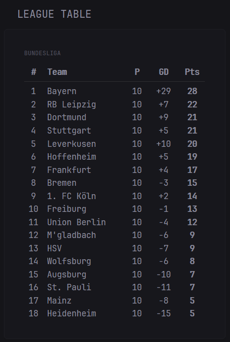

```yaml
- type: custom-api
  title: League Table
  cache: 2h
  url: https://api.football-data.org/v4/competitions/${COMPETITION_ID}/standings
  headers:
    X-Auth-Token: ${FOOTBALL_DATA_TOKEN}
  template: |
    <div style="padding: 10px; font-size: 0.85em;">
      {{ $compName := .JSON.String "competition.name" }}
      <div class="color-subdue" style="font-size: 0.75em; margin-bottom: 6px; text-transform: uppercase;">{{ $compName }}</div>
      {{ $standings := .JSON.Array "standings" }}
      {{ if $standings }}
        {{ $standing := index $standings 0 }}
        {{ $table := $standing.Array "table" }}
        <div style="display: grid; grid-template-columns: 25px 1.5fr 30px 30px 35px; gap: 6px; padding: 4px 0; border-bottom: 1px solid rgba(255,255,255,0.1); font-weight: bold; margin-bottom: 4px;">
          <div style="text-align: center;">#</div>
          <div>Team</div>
          <div style="text-align: center;">P</div>
          <div style="text-align: center;">GD</div>
          <div style="text-align: center;">Pts</div>
        </div>
        {{ range $table }}
          {{ $position := .Int "position" }}
          {{ $team := .Get "team" }}
          {{ $teamName := $team.String "shortName" }}
          {{ $played := .Int "playedGames" }}
          {{ $gd := .Int "goalDifference" }}
          {{ $points := .Int "points" }}
          {{ $teamId := $team.Int "id" }}

          {{ $rowStyle := "padding: 4px 0;" }}
          {{ $textStyle := "" }}
          {{ if eq $teamId ${TEAM_ID} }}
            {{ $rowStyle = "padding: 4px 0; background: rgba(255,255,255,0.05); border-left: 3px solid var(--color-highlight);" }}
            {{ $textStyle = "font-weight: bold; color: var(--color-highlight);" }}
          {{ end }}

          <div style="display: grid; grid-template-columns: 25px 1.5fr 30px 30px 35px; gap: 6px; {{ $rowStyle }}">
            <div style="text-align: center; {{ $textStyle }}">{{ $position }}</div>
            <div style="white-space: nowrap; overflow: hidden; text-overflow: ellipsis; {{ $textStyle }}">{{ $teamName }}</div>
            <div style="text-align: center; {{ $textStyle }}">{{ $played }}</div>
            <div style="text-align: center; {{ $textStyle }}">{{ if gt $gd 0 }}+{{ end }}{{ $gd }}</div>
            <div style="text-align: center; font-weight: bold; {{ $textStyle }}">{{ $points }}</div>
          </div>
        {{ end }}
      {{ else }}
        <div class="color-negative">Unable to load standings</div>
      {{ end }}
    </div>
```

## Environment variablesF

- `COMPETITION_ID` - the competitions football-data ID. You can find it [here](https://api.football-data.org/v4/competitions/)
- `FOOTBALL_DATA_TOKEN` - the API key for football-data. It is sent via e-mail when you sign up [here](https://www.football-data.org/client/register)
