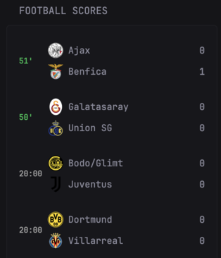

# ⚽ ESPN Live Football Scores Widget

A custom widget that displays live, upcoming, and finished football (soccer) scores using the **ESPN Scoreboard API**.  
This widget supports:

- Live match timers (green when “in progress”)
- Team logos (with fallback image)
- Short team names with ellipsis truncation
- Scheduled match times
- Postponed / Canceled statuses
- Responsive layout inside Glance dashboard

## 📸 Preview



## 📦 Features

✔ Real-time football scores (auto refresh every 15 seconds)  
✔ Clean two-team layout with logos and scores  
✔ Live timer (green) using `displayClock`  
✔ Responsive team name truncation  
✔ Handles all match states (scheduled, live, postponed, canceled)  
✔ Easy integration with Glance’s `custom-api` widget system

## 🚀 Installation (Add This Widget to Glance)

Add the following block under `widgets:` in your `glance.yml`:

```yaml
- type: custom-api
  title: Football Scores
  cache: 15s
  url: https://site.api.espn.com/apis/site/v2/sports/soccer/all/scoreboard
  template: |
    {{- $fallback := "/assets/default-team-logo.png" -}}

    <ul class="list list-gap-10 collapsible-container" data-collapse-after="5">
     {{ range .JSON.Array "events" }}
      <li>
         {{ $competitions := .Array "competitions" }}
         {{ if gt (len $competitions) 0 }}
          {{ $comp0 := index $competitions 0 }}
          {{ $competitors := $comp0.Array "competitors" }}
          {{ if ge (len $competitors) 2 }}
            {{ $c0 := index $competitors 0 }}
            {{ $c1 := index $competitors 1 }}

            {{ $short := $comp0.String "status.type.shortDetail" }}
            {{ $state := $comp0.String "status.type.state" }}

            <div style="display:flex; gap:10px; padding:8px 0;">

              <div style="width:30px; font-weight:bold; font-size: 11px; display:flex; align-items:center;">
                {{- if eq $short "Scheduled" -}}
                  {{- $date := $comp0.String "date" -}}
                  <span style="color:#aaa;">
                    {{ printf "%s:%s" (slice $date 11 13) (slice $date 14 16) }}
                  </span>
                {{- else if eq $state "in" -}}
                  <span style="color:#00c853;">{{ $comp0.String "status.displayClock" }}</span>
                {{- else if eq $short "Postponed" -}}
                  <span style="color:#aaa;">Post.</span>
                {{- else if eq $short "Canceled" -}}
                  <span style="color:#aaa;">Canc.</span>
                {{- else -}}
                  <span style="color:#aaa;">{{ $short }}</span>
                {{- end }}
              </div>

              <div style="flex:1; display:flex; flex-direction:column; gap:6px;">

                {{- $logo0 := $c0.String "team.logo" -}}
                <div style="display:flex; align-items:center; justify-content:space-between; width:100%;">
                  <div style="display:flex; align-items:center; gap:6px; min-width:0; flex:1;">
                      {{ if ne $logo0 "" }}
                        
                      {{ else }}
                        
                      {{ end }}
                      <span style="white-space:nowrap; overflow:hidden; text-overflow:ellipsis; min-width:0;">
                          {{ $c0.String "team.shortDisplayName" }}
                      </span>
                  </div>
                  <span style="font-weight:700;">{{ $c0.String "score" }}</span>
                </div>

                {{- $logo1 := $c1.String "team.logo" -}}
                <div style="display:flex; align-items:center; justify-content:space-between; width:100%;">
                  <div style="display:flex; align-items:center; gap:6px; min-width:0;">
                    {{ if ne $logo1 "" }}
                      
                    {{ else }}
                      
                    {{ end }}
                    <span style="white-space:nowrap; overflow:hidden; text-overflow:ellipsis; min-width:0;">
                      {{ $c1.String "team.shortDisplayName" }}
                    </span>
                  </div>
                  <span style="font-weight:700;">{{ $c1.String "score" }}</span>
                </div>

              </div>

            </div>
          {{ end }}
         {{ end }}
       </li>
     {{ end }}
    </ul>
```

## 📝 Notes

- Add `default-team-logo.png` file to `/assets/default-team-logo.png`.
- API refreshes often; cache is set to 15s for optimal performance.
