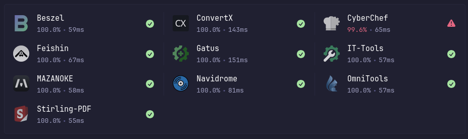
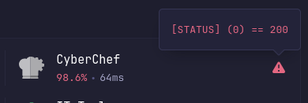
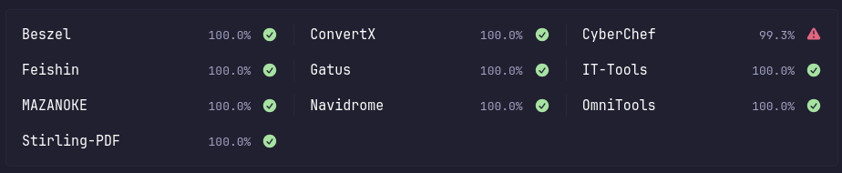

## Introduction

This widget mimics the style of the builtin
[monitor](https://github.com/glanceapp/glance/blob/main/docs/configuration.md#monitor)
widget, but it pulls the data from a [Gatus](https://github.com/TwiN/gatus)
instance instead. This allows including details like the uptime percentage and
detailed status check results, in addition to the response times.

If you encounter any issues, please open an issue, tag me, and I’ll investigate further.

Customisation can be applied using the `options:` field. See [Options](#options) for more details.

## Preview







## Environment Variables

> [!IMPORTANT]
>
> For URLs, you **MUST** include `http://` or `https://`.
> Do **NOT** include a trailing `/` at the end of URLs.

* `GATUS_URL` - The Gatus URL, e.g., `http://<ip_address>:<port>` or `https://<domain>`

## Options

Since `v0.8.0`, you can use the `options:` field to customise the widget.
See [v0.8.0 Release Notes](https://github.com/glanceapp/glance/releases/tag/v0.8.0#g-rh-15) for more information.

Default options are:
```yaml
options:
  # Required options
  base-url: ${GATUS_URL} # Your environment-variables for the URL

  # Optional options
  style: "full"             # Display mode fo the widget, either `full`, or `compact`.
  duration: "24h"           # The duration for the uptime and response time stats to be averaged over.
  groupFilter: ""           # Filter to only show endpoints within this group from Gatus (or "" to include all groups).
  compactMetric: "uptime"   # Which metric to show in `compact` style, either `uptime` or `response-time`
  showFailingOnly: false    # Only display services currently failing healtchecks.
  showOnlyConfigured: false # Display only the endpoints which have an explicitly configured icon/url in these options.

  # Endpoint options
  <ENDPOINT_NAME>: sh:immich               # The display icon for the endpoint, supports URLS or the icon prefixes `si:`, `sh:`, `di:` or `mdi:`.
  <ENDPOINT_NAME>-url: https://example.com # Url to link to rather than the gatus page for the endpoint
```

### Endpoint Options

By default this widget will automatically discover the endpoints configured in
gatus and display them here. However you can add additional options to this
widget to include icons and custom urls to link to for each endpoint. The
`<ENDPOINT_NAME>` should match _exactly_ the endpoint name configured in Gatus
(it can be quoted if the endpoint name includes special characters).

For example the options for the preview screenshot are:

```yaml
options:
  base-url: http://gatus.example.com
  show-only-configured: true

  Beszel: sh:beszel
  ConvertX: sh:convertx.png
  CyberChef: sh:cyberchef
  Feishin: sh:feishin.png
  Gatus: sh:gatus
  IT-Tools: di:it-tools-light
  MAZANOKE: sh:mazanoke
  Navidrome: sh:navidrome
  OmniTools: sh:omnitools.png
  Stirling-PDF: sh:stirling-pdf
```

## Widget YAML

```yaml
- type: custom-api
  title: Gatus
  cache: 5m
  options:
    base-url: ${GATUS_URL}

    style: full
    duration: 24h
    groupFilter: ""
    compactMetric: uptime
    showFailingOnly: false
    showOnlyConfigured: false
  template: |
    {{/* Required config options */}}
    {{ $baseURL := .Options.StringOr "base-url" "" }}

    {{/* Optional config options */}}
    {{ $duration := .Options.StringOr "duration" "24h" }}
    {{ $style := .Options.StringOr "style" "full" }}
    {{ $groupFilter := .Options.StringOr "group" "" }}
    {{ $compactMetric := .Options.StringOr "compact-metric" "uptime" }}
    {{ $showFailingOnly := .Options.BoolOr "show-failing-only" false }}
    {{ $showOnlyConfigured := .Options.BoolOr "show-only-configured" false }}


    {{/* Error message template */}}
    {{ define "errorMsg" }}
      <div class="widget-error-header">
        <div class="color-negative size-h3">ERROR</div>
        <svg class="widget-error-icon" xmlns="http://www.w3.org/2000/svg" fill="none" viewBox="0 0 24 24" stroke-width="1.5">
          <path stroke-linecap="round" stroke-linejoin="round" d="M12 9v3.75m-9.303 3.376c-.866 1.5.217 3.374 1.948 3.374h14.71c1.73 0 2.813-1.874 1.948-3.374L13.949 3.378c-.866-1.5-3.032-1.5-3.898 0L2.697 16.126ZM12 15.75h.007v.008H12v-.008Z"></path>
        </svg>
      </div>
      <p class="break-all">{{ . }}</p>
    {{ end }}

    {{/* Popover template */}}
    {{ define "popover" }}
      <div data-popover-html>
        <div style="margin: 5px;">
          <p class="margin-top-12" style="overflow-y: auto; text-align: justify; max-height: 20rem;">
            {{ range .Array "conditionResults" }}
              {{ if (.Bool "success") }}
                <p class="color-positive">{{ .String "condition" }}</p>
              {{ else }}
                <p class="color-negative">{{ .String "condition" }}</p>
              {{ end }}
            {{ end }}
          </p>
        </div>
      </div>
    {{ end }}

    {{ $endpoints := newRequest (print $baseURL "/api/v1/endpoints/statuses") 
        | getResponse }}

    {{ $options := .Options }}
    {{ $displayedItems := 0 }}
    {{ if eq $style "compact" }}
      <ul class="dynamic-columns list-gap-8 ">
      {{ range $i, $endpoint := $endpoints.JSON.Array "" }}
          {{ $name := $endpoint.String "name" }}
          {{ $key := $endpoint.String "key" }}
          {{ $group := $endpoint.String "group" }}
          {{ $linkUrlOption := $options.StringOr (concat $name "-url") "" }}
          {{ $linkUrl := $options.StringOr (concat $name "-url") (concat $baseURL "/endpoints/" $key) }}
          {{ $lastResult := index ( $endpoint.Array "results" ) (sub (len ($endpoint.Array "results")) 1) }}
          {{ $latestSuccess := $lastResult.Bool "success" }}

          {{ if and $groupFilter (not (eq $groupFilter $group)) }} {{ continue }} {{ end }}
          {{ if and $showFailingOnly $latestSuccess }} {{ continue }} {{ end }}
          {{ if and $showOnlyConfigured (eq $linkUrlOption "") }} {{ continue }} {{ end }}
          {{ $displayedItems = add $displayedItems 1 }}

          {{ $responseTime := "" }}
          {{ $uptime := "" }}
          {{ $uptimeValue := "" }}

          {{ if eq $compactMetric "uptime" }}
            {{ $uptime = newRequest (print $baseURL "/api/v1/endpoints/" $key "/uptimes/" $duration )
                | getResponse }}
            {{ $uptimeValue = mul 100 ($uptime.JSON.Float "") }}
          {{ else }}
            {{ $responseTime = newRequest (print $baseURL "/api/v1/endpoints/" $key "/response-times/" $duration )
                | getResponse }}
          {{ end }}

          <div class="flex items-center gap-12">
            <a class="size-title-dynamic color-highlight text-truncate block grow" href="{{ $linkUrl | safeURL }}" target="_blank" rel="noreferrer">{{ $name }}</a>
            <a href="{{ $linkUrl | safeURL }}" target="_blank" rel="noreferrer">
              {{ if eq $compactMetric "uptime" }}
                <div>{{ printf "%.1f" $uptimeValue }}%</div>
              {{ else }}
                <div>{{ $responseTime.JSON.Int "" }}ms</div>
              {{ end }}
            </a>

            {{ if $latestSuccess }}
              <div class="monitor-site-status-icon-compact">
                <a href="{{ $linkUrl | safeURL }}" target="_blank" rel="noreferrer">
                  <div data-popover-type="html" data-popover-position="above" data-popover-show-delay="500" style="align-content: center;">
                    {{ template "popover" $lastResult }}
                    <svg fill="var(--color-positive)" xmlns="http://www.w3.org/2000/svg" viewBox="0 0 20 20">
                      <path fill-rule="evenodd" d="M10 18a8 8 0 1 0 0-16 8 8 0 0 0 0 16Zm3.857-9.809a.75.75 0 0 0-1.214-.882l-3.483 4.79-1.88-1.88a.75.75 0 1 0-1.06 1.061l2.5 2.5a.75.75 0 0 0 1.137-.089l4-5.5Z" clip-rule="evenodd" />
                    </svg>
                  </div>
                </a>
              </div>
            {{ else }}
              <div class="monitor-site-status-icon-compact">
                <a href="{{ $linkUrl | safeURL }}" target="_blank" rel="noreferrer">
                  <div data-popover-type="html" data-popover-position="above" data-popover-show-delay="500" style="align-content: center;">
                    {{ template "popover" $lastResult }}
                    <svg fill="var(--color-negative)" xmlns="http://www.w3.org/2000/svg" viewBox="0 0 20 20">
                      <path fill-rule="evenodd" d="M8.485 2.495c.673-1.167 2.357-1.167 3.03 0l6.28 10.875c.673 1.167-.17 2.625-1.516 2.625H3.72c-1.347 0-2.189-1.458-1.515-2.625L8.485 2.495ZM10 5a.75.75 0 0 1 .75.75v3.5a.75.75 0 0 1-1.5 0v-3.5A.75.75 0 0 1 10 5Zm0 9a1 1 0 1 0 0-2 1 1 0 0 0 0 2Z" clip-rule="evenodd" />
                    </svg>
                  </div>
                </a>
              </div>
            {{ end }}

          </div>
        {{ end }}
      </ul>
    {{ else }}

      <ul class="dynamic-columns list-gap-20 list-with-separator">
      {{ range $i, $endpoint := $endpoints.JSON.Array "" }}
          {{ $name := $endpoint.String "name" }}
          {{ $key := $endpoint.String "key" }}
          {{ $group := $endpoint.String "group" }}
          {{ $icon := $options.StringOr $name "" }}
          {{ $linkUrlOption := $options.StringOr (concat $name "-url") "" }}
          {{ $linkUrl := $options.StringOr (concat $name "-url") (concat $baseURL "/endpoints/" $key) }}
          {{ $lastResult := index ( $endpoint.Array "results" ) (sub (len ($endpoint.Array "results")) 1) }}
          {{ $latestSuccess := $lastResult.Bool "success" }}

          {{ if and $groupFilter (not (eq $groupFilter $group)) }} {{ continue }} {{ end }}
          {{ if and $showFailingOnly $latestSuccess }} {{ continue }} {{ end }}
          {{ if and $showOnlyConfigured (or (eq $linkUrlOption "") (eq $icon "")) }} {{ continue }} {{ end }}
          {{ $displayedItems = add $displayedItems 1 }}

          {{ $uptime := newRequest (print $baseURL "/api/v1/endpoints/" $key "/uptimes/" $duration )
              | getResponse }}
          {{ $responseTime := newRequest (print $baseURL "/api/v1/endpoints/" $key "/response-times/" $duration )
              | getResponse }}

          {{ $uptimeValue := mul 100 ($uptime.JSON.Float "") }}

          {{ $iconUrl := "" }}
          {{ if $icon }}
            {{ $iconPrefix := findMatch "^(si|di|mdi|sh):" $icon }}
            {{ $iconBase := replaceMatches "^(si|di|mdi|sh):" "" $icon }}

            {{ $iconExt := findMatch "\\.[a-z]+$" $iconBase }}
            {{ $iconExt := replaceMatches "\\." "" $iconExt }}
            {{ $iconBase = replaceMatches "\\.[a-z]+$" "" $iconBase }}
            {{ if eq $iconExt "" }} {{ $iconExt = "svg" }} {{ end }}

            {{ if eq $iconPrefix "si:" }}
              {{ $iconUrl = concat "https://cdn.jsdelivr.net/npm/simple-icons@latest/icons/" $iconBase ".svg" }}
            {{ else if eq $iconPrefix "di:" }}
              {{ $iconUrl = concat "https://cdn.jsdelivr.net/gh/homarr-labs/dashboard-icons/" $iconExt "/" $iconBase "." $iconExt }}
            {{ else if eq $iconPrefix "mdi:" }}
              {{ $iconUrl = concat "https://cdn.jsdelivr.net/npm/@mdi/svg@latest/svg/" $iconBase ".svg" }}
            {{ else if eq $iconPrefix "sh:" }}
              {{ $iconUrl = concat "https://cdn.jsdelivr.net/gh/selfhst/icons/" $iconExt "/" $iconBase "." $iconExt }}
            {{ else }}
              {{ $iconUrl = $icon }}
            {{ end }}
          {{ end }}

          <div class="monitor-site flex items-center gap-15">
            {{ if $iconUrl }}
              <a href="{{ $linkUrl | safeURL }}" target="_blank" rel="noreferrer">
                
              </a>
            {{ end }}
            <div class="grow min-width-0">
              <a class="size-h3 color-highlight text-truncate block" href="{{ $linkUrl | safeURL }}" target="_blank" rel="noreferrer">{{ $name }}</a>

              <a href="{{ $linkUrl | safeURL }}" target="_blank" rel="noreferrer">
                <ul class="list-horizontal-text">
                  <li class="{{ if not $latestSuccess }}color-negative{{ end }}">{{ printf "%.1f" $uptimeValue }}%</li>
                  <li>{{ $responseTime.JSON.Int "" }}ms</li>
                </ul>
              </a>
            </div>

            {{ if $latestSuccess }}
              <div class="monitor-site-status-icon">
                <a href="{{ $linkUrl | safeURL }}" target="_blank" rel="noreferrer">
                  <div data-popover-type="html" data-popover-position="above" data-popover-show-delay="500" style="align-content: center;">
                    {{ template "popover" $lastResult }}
                    <svg fill="var(--color-positive)" xmlns="http://www.w3.org/2000/svg" viewBox="0 0 20 20">
                      <path fill-rule="evenodd" d="M10 18a8 8 0 1 0 0-16 8 8 0 0 0 0 16Zm3.857-9.809a.75.75 0 0 0-1.214-.882l-3.483 4.79-1.88-1.88a.75.75 0 1 0-1.06 1.061l2.5 2.5a.75.75 0 0 0 1.137-.089l4-5.5Z" clip-rule="evenodd" />
                    </svg>
                  </div>
                </a>
              </div>
            {{ else }}
              <div class="monitor-site-status-icon">
                <a href="{{ $linkUrl | safeURL }}" target="_blank" rel="noreferrer">
                  <div data-popover-type="html" data-popover-position="above" data-popover-show-delay="500" style="align-content: center;">
                    {{ template "popover" $lastResult }}
                    <svg fill="var(--color-negative)" xmlns="http://www.w3.org/2000/svg" viewBox="0 0 20 20">
                      <path fill-rule="evenodd" d="M8.485 2.495c.673-1.167 2.357-1.167 3.03 0l6.28 10.875c.673 1.167-.17 2.625-1.516 2.625H3.72c-1.347 0-2.189-1.458-1.515-2.625L8.485 2.495ZM10 5a.75.75 0 0 1 .75.75v3.5a.75.75 0 0 1-1.5 0v-3.5A.75.75 0 0 1 10 5Zm0 9a1 1 0 1 0 0-2 1 1 0 0 0 0 2Z" clip-rule="evenodd" />
                    </svg>
                  </div>
                </a>
              </div>
            {{ end }}

          </div>
        {{ end }}
      </ul>
    {{ end }}

    {{ if eq $displayedItems 0 }}
      <div class="flex items-center justify-center gap-10 padding-block-5">
        <p>All sites are online</p>
        <svg class="shrink-0" style="width: 1.7rem;" xmlns="http://www.w3.org/2000/svg" viewBox="0 0 24 24" fill="var(--color-positive)">
          <path fill-rule="evenodd" d="M2.25 12c0-5.385 4.365-9.75 9.75-9.75s9.75 4.365 9.75 9.75-4.365 9.75-9.75 9.75S2.25 17.385 2.25 12Zm13.36-1.814a.75.75 0 1 0-1.22-.872l-3.236 4.53L9.53 12.22a.75.75 0 0 0-1.06 1.06l2.25 2.25a.75.75 0 0 0 1.14-.094l3.75-5.25Z" clip-rule="evenodd" />
        </svg>
      </div>
    {{ end }}
```

