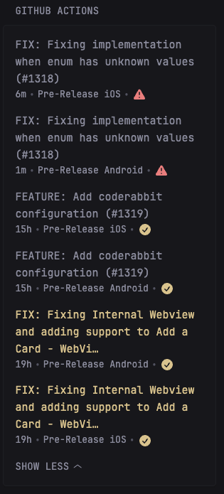

```yaml
- type: custom-api
  title: GitHub Actions
  url: https://api.github.com/repos/OWNER/REPO_NAME/actions/runs
  cache: 5m
  parameters:
    branch: develop
    exclude_pull_requests: true
    per_page: 6
  headers:
    Authorization: Bearer ${GITHUB_TOKEN}
    Accept: application/vnd.github.v3+json
    User-Agent: Glance-Dashboard
  template: |
    <div class="github-repos">
      <ul class="list list-gap-14 collapsible-container" data-collapse-after="2">
       
        {{ range .JSON.Array "workflow_runs" }}
          {{ $rzt := .String "conclusion" }}
          <li>
            <a class="size-h3 color-primary-if-not-visited" href="{{ .String "html_url" }}">{{ .String "display_title" }}</a>
            <h3><a href="" target=""></a></h3>
            <p>{{ .String "description" }}</p>
            <ul class="list-horizontal-text">
              <li data-popover-type="html" {{ .String "updated_at" | parseTime "rfc3339" | toRelativeTime }}></li>              
              <li data-popover-type="html"><div data-popover-html="">{{ .String "actor.login" }}</div>{{ .String "name" }}</li>
              <li data-popover-type="html"><div data-popover-html="">{{ .String "status" }}</div>
              {{ if eq $rzt "success" }}
                <svg width="20" height="20" fill="var(--color-positive)" xmlns="http://www.w3.org/2000/svg" viewBox="0 0 20 20">
                  <path fill-rule="evenodd" d="M10 18a8 8 0 1 0 0-16 8 8 0 0 0 0 16Zm3.857-9.809a.75.75 0 0 0-1.214-.882l-3.483 4.79-1.88-1.88a.75.75 0 1 0-1.06 1.061l2.5 2.5a.75.75 0 0 0 1.137-.089l4-5.5Z" clip-rule="evenodd" />
                </svg>
              {{ else }}
                <svg width="20" height="20" fill="var(--color-negative)" xmlns="http://www.w3.org/2000/svg" viewBox="0 0 20 20">
                  <path fill-rule="evenodd" d="M8.485 2.495c.673-1.167 2.357-1.167 3.03 0l6.28 10.875c.673 1.167-.17 2.625-1.516 2.625H3.72c-1.347 0-2.189-1.458-1.515-2.625L8.485 2.495ZM10 5a.75.75 0 0 1 .75.75v3.5a.75.75 0 0 1-1.5 0v-3.5A.75.75 0 0 1 10 5Zm0 9a1 1 0 1 0 0-2 1 1 0 0 0 0 2Z" clip-rule="evenodd" />
                </svg>
              {{ end }}
              </li>
            </ul>
          </li>
        {{ end }}
      </ul>
    </div>
```

## Environment variables

- `GITHUB_TOKEN`: Your GitHub Personal Access Token, you can create a token from Github settings. Navigate to _GitHub Settings > Developer settings > Personal access tokens > Tokens (classic)_, and create a new token with _notifications_ scope selected.

## Other notes

- Modify the URL to point to your own repository by changing `OWNER/REPO_NAME`.
- Pass parameters like `branch`, `status` and other from the [GitHub Actions API](https://docs.github.com/en/rest/actions/workflow-runs?apiVersion=2022-11-28#list-workflow-runs-for-a-repository) as needed.
- Edit `data-collapse-after` value to show more or fewer items before collapsing.
