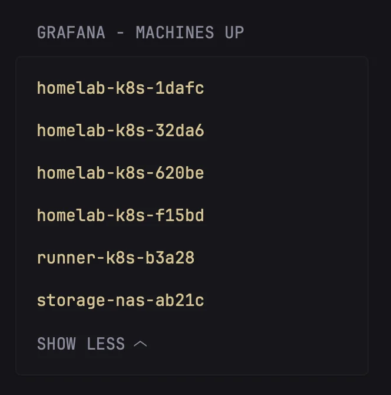
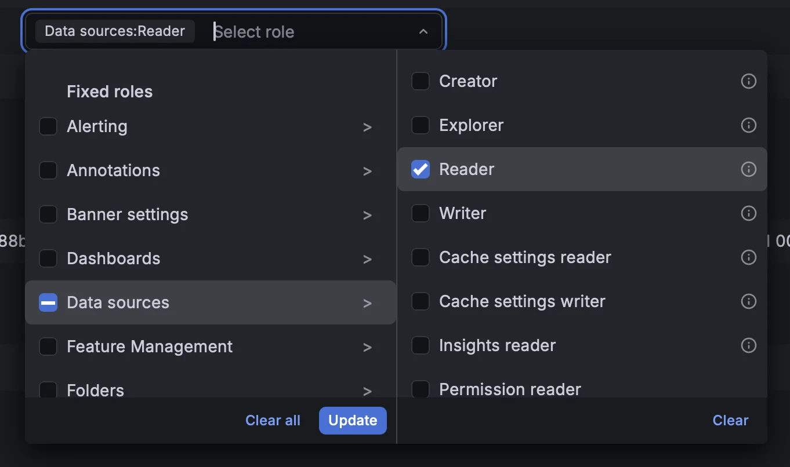

# Grafana

Provides useful information and metrics from a [Grafana](https://grafana.com)
data source (prometheus, mimir, loki, etc etc)

It supports both SaaS grafana.com offering and a self-hosted Grafana OSS
instance, as long as we can get access to the API with a Service Account.

## Preview




## How to use

From your Grafana Instance, Create a Service Account with DataSource Reader
permissions:



From the same page, create a new Token that will be used for the API call.

Make the token available as an environmental variable, called `GRAFANA_TOKEN`,
or if you just want to test it out replace the `${GRAFANA_TOKEN}` in the code.

Similarly, write down your Grafana Dashboard base URL, you can store it in
`GRAFANA_URL` environmental variable or hard code it. This is the base url
of your instance  (ex: `https://instance-name.grafana.net` or the equivalent
to access your self-hosted instance).

Then copy-paste this code and add it to your Glance configuration:

```yaml
- type: custom-api
  title: Grafana - Machines UP
  cache: 5m
  url: ${GRAFANA_URL}/api/ds/query
  method: POST
  headers:
    Authorization: Bearer ${GRAFANA_TOKEN}
    Accept: application/json
  body-type: json
  body:
    queries:
      - datasource:
          type: prometheus
          uid: grafanacloud-prom
        expr: group(up{job=~".*node_exporter.*"}) by (instance)
        legendFormat: '{{instance}}'
        refId: A
        range: true
        instant: false
        intervalMs: 60000
        maxDataPoints: 5
    from: now-5m
    to: now
  template: |
    <ul class="list list-gap-14 collapsible-container" data-collapse-after="5">
    {{ range .JSON.Array "results.A.frames" }}
      <li>
          <a
            href="${GRAFANA_URL}/d/nodes/linux-node-overview?var-instance={{ .String "schema.fields.1.config.displayNameFromDS" }}"
            class="size-title-dynamic color-primary-if-not-visited" target="_blank" rel="noreferrer"
          >
            {{ .String "schema.fields.1.config.displayNameFromDS" }}
          </a>
      </li>
    {{ end }}
    </ul>
```

> [!hint] Make sure to customize the Datasource
> You might need to customize the Datasource unique ID (uid), type and query.
>
> The default values should be good for Grafana.com SaaS instances, and with
> links to the default Linux dashboards. Feel free to change these based on
> your configuration.

You can read more about the Grafana API for Datasource queries in the
[documentation here](https://grafana.com/docs/grafana/latest/developers/http_api/data_source/#query-a-data-source)
Enjoy it! :~)
