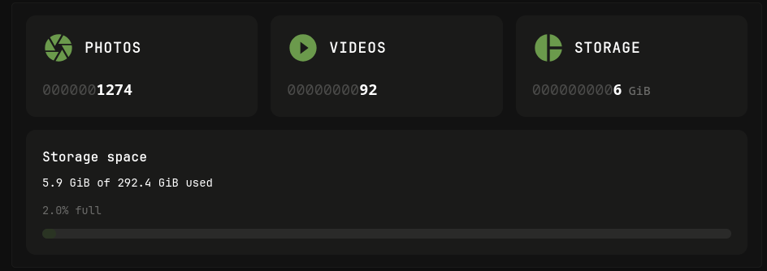

# Immich Stats Widget for Glance



## Prerequisites

You will need two environment variables set in your Glance environment:
1.  `IMMICH_URL`: The full URL to your Immich instance (e.g., `https://photos.example.com`).
2.  `IMMICH_KEY`: An API Key generated from your Immich user settings.

## Configuration

### 1. Generate the api key

Learn how: https://my.immich.app/user-settings?isOpen=api-keys

Set these permissions: `server.statistics` and `server.storage`

### 2. Place the following code in your dashboard

```yaml
- type: custom-api
  title: Immich Stats
  hide-header: true
  cache: 10m
  url: ${IMMICH_URL}/api/server/statistics
  headers:
    x-api-key: ${IMMICH_KEY}
  subrequests:
    storage:
      url: ${IMMICH_URL}/api/server/storage
      headers:
        x-api-key: ${IMMICH_KEY} 
  options:
    show-cards: true
    show-storage-bar: true
  template: |
    {{ $photos := .JSON.Int "photos" }}
    {{ $videos := .JSON.Int "videos" }}
    {{ $usageBytes := .JSON.Int "usage" }}
    {{ $usageGiB := div (toFloat $usageBytes) 1073741824.0 }}
    {{ $storage := .Subrequest "storage" }}
    {{ $storage_ok := and (ge $storage.Response.StatusCode 200) (le $storage.Response.StatusCode 299) }}
    {{ $totalGiB := 0.0 }}
    {{ $percentage := 0.0 }}
    {{ $storageError := "" }}
    {{ if $storage_ok }}
      {{ $totalGiB = div (toFloat ($storage.JSON.Int "diskSizeRaw")) 1073741824.0 }}
      {{ $percentage = $storage.JSON.Float "diskUsagePercentage" }}
    {{ else }}
      {{ $storageError = printf "%d %s" $storage.Response.StatusCode $storage.Response.Status }}
    {{ end }}
    {{ $showCards := .Options.BoolOr "show-cards" true }}
    {{ $showStorageBar := .Options.BoolOr "show-storage-bar" true }}

    {{ if $showCards }}
    <div style="display: flex; gap: 16px; flex-wrap: wrap;{{ if $showStorageBar }} margin-bottom: 16px;{{ end }}">
      <!-- Photos Card -->
      <div style="display: flex; flex-direction: column; justify-content: space-between; background-color: var(--color-widget-background-highlight); border-radius: 12px; padding: 20px; flex: 1; min-width: 200px;">
        <div style="display: flex; align-items: center; gap: 12px; margin-bottom: 16px;">
          <svg style="width: 40px; height: 40px; color: var(--color-primary); flex-shrink: 0;" viewBox="0 0 24 24" fill="currentColor">
            <path d="M13.73,15L9.83,21.76C10.53,21.91 11.25,22 12,22C14.4,22 16.6,21.15 18.32,19.75L14.66,13.4M2.46,15C3.38,17.92 5.61,20.26 8.45,21.34L12.12,15M8.54,12L4.64,5.25C3,7 2,9.39 2,12C2,12.68 2.07,13.35 2.2,14H9.69M21.8,10H14.31L14.6,10.5L19.36,18.75C21,16.97 22,14.6 22,12C22,11.31 21.93,10.64 21.8,10M21.54,9C20.62,6.07 18.39,3.74 15.55,2.66L11.88,9M9.4,10.5L14.17,2.24C13.47,2.09 12.75,2 12,2C9.6,2 7.4,2.84 5.68,4.25L9.34,10.6L9.4,10.5Z"/>
          </svg>
          <span style="font-weight: 600; font-size: 1.8rem; text-transform: uppercase; letter-spacing: 0.5px; color: var(--color-text-highlight);">Photos</span>
        </div>
        <div style="font-family: ui-monospace, monospace; font-size: 1.85rem; font-weight: 700; color: var(--color-text-highlight); word-break: break-all;">
          {{ if lt $photos 10 }}<span style="color: var(--color-text-subdue); font-weight: 400; opacity: 0.6;">000000000</span>{{ else if lt $photos 100 }}<span style="color: var(--color-text-subdue); font-weight: 400; opacity: 0.6;">00000000</span>{{ else if lt $photos 1000 }}<span style="color: var(--color-text-subdue); font-weight: 400; opacity: 0.6;">0000000</span>{{ else if lt $photos 10000 }}<span style="color: var(--color-text-subdue); font-weight: 400; opacity: 0.6;">000000</span>{{ else if lt $photos 100000 }}<span style="color: var(--color-text-subdue); font-weight: 400; opacity: 0.6;">00000</span>{{ else if lt $photos 1000000 }}<span style="color: var(--color-text-subdue); font-weight: 400; opacity: 0.6;">0000</span>{{ end }}{{ $photos }}
        </div>
      </div>

      <!-- Videos Card -->
      <div style="display: flex; flex-direction: column; justify-content: space-between; background-color: var(--color-widget-background-highlight); border-radius: 12px; padding: 20px; flex: 1; min-width: 200px;">
        <div style="display: flex; align-items: center; gap: 12px; margin-bottom: 16px;">
          <svg style="width: 40px; height: 40px; color: var(--color-primary); flex-shrink: 0;" viewBox="0 0 24 24" fill="currentColor">
            <path d="M10,16.5V7.5L16,12M12,2A10,10 0 0,0 2,12A10,10 0 0,0 12,22A10,10 0 0,0 22,12A10,10 0 0,0 12,2Z"/>
          </svg>
          <span style="font-weight: 600; font-size: 1.8rem; text-transform: uppercase; letter-spacing: 0.5px; color: var(--color-text-highlight);">Videos</span>
        </div>
        <div style="font-family: ui-monospace, monospace; font-size: 1.85rem; font-weight: 700; color: var(--color-text-highlight); word-break: break-all;">
          {{ if lt $videos 10 }}<span style="color: var(--color-text-subdue); font-weight: 400; opacity: 0.6;">000000000</span>{{ else if lt $videos 100 }}<span style="color: var(--color-text-subdue); font-weight: 400; opacity: 0.6;">00000000</span>{{ else if lt $videos 1000 }}<span style="color: var(--color-text-subdue); font-weight: 400; opacity: 0.6;">0000000</span>{{ else if lt $videos 10000 }}<span style="color: var(--color-text-subdue); font-weight: 400; opacity: 0.6;">000000</span>{{ else if lt $videos 100000 }}<span style="color: var(--color-text-subdue); font-weight: 400; opacity: 0.6;">00000</span>{{ else if lt $videos 1000000 }}<span style="color: var(--color-text-subdue); font-weight: 400; opacity: 0.6;">0000</span>{{ end }}{{ $videos }}
        </div>
      </div>

      <!-- Storage GiB Card -->
      <div style="display: flex; flex-direction: column; justify-content: space-between; background-color: var(--color-widget-background-highlight); border-radius: 12px; padding: 20px; flex: 1; min-width: 200px;">
        <div style="display: flex; align-items: center; gap: 12px; margin-bottom: 16px;">
          <svg style="width: 40px; height: 40px; color: var(--color-primary); flex-shrink: 0;" viewBox="0 0 24 24" fill="currentColor">
            <path d="M11,2V22C5.9,21.5 2,17.2 2,12C2,6.8 5.9,2.5 11,2M13,2V11H22C21.5,6.2 17.8,2.5 13,2M13,13V22C17.7,21.5 21.5,17.8 22,13H13Z"/>
          </svg>
          <span style="font-weight: 600; font-size: 1.8rem; text-transform: uppercase; letter-spacing: 0.5px; color: var(--color-text-highlight);">Storage</span>
        </div>
      <div style="font-family: ui-monospace, monospace; font-size: 1.85rem; font-weight: 700; color: var(--color-text-highlight); word-break: break-all;">
        {{ $gib := printf "%.0f" $usageGiB }}
        {{ if lt $usageGiB 10.0 }}<span style="color: var(--color-text-subdue); font-weight: 400; opacity: 0.6;">000000000</span>{{ else if lt $usageGiB 100.0 }}<span style="color: var(--color-text-subdue); font-weight: 400; opacity: 0.6;">00000000</span>{{ else if lt $usageGiB 1000.0 }}<span style="color: var(--color-text-subdue); font-weight: 400; opacity: 0.6;">0000000</span>{{ end }}{{ $gib }}<span style="font-size: 1.5rem; font-weight: 500; color: var(--color-text-subdue); margin-left: 8px;">GiB</span>
      </div>
      </div>
    </div>
    {{ end }}

    {{ if $showStorageBar }}
    <!-- Progress Bar Section -->
    <div style="background-color: var(--color-widget-background-highlight); border-radius: 12px; padding: 20px;">
      <div style="font-weight: 600; color: var(--color-text-highlight); margin-bottom: 8px; font-size: 1.6rem;">Storage space</div>
      {{ if gt $totalGiB 0.0 }}
        <div style="color: var(--color-text-highlight); font-size: 1.4rem; margin-bottom: 12px; font-weight: 500;">{{ printf "%.1f" $usageGiB }} GiB of {{ printf "%.1f" $totalGiB }} GiB used</div>
        <div style="color: var(--color-text-subdue); font-size: 1.35rem; margin-bottom: 12px;">{{ printf "%.1f" $percentage }}% full</div>
      {{ else }}
        <div style="color: var(--color-text-highlight); font-size: 1.4rem; margin-bottom: 12px; font-weight: 500;">{{ printf "%.1f" $usageGiB }} GiB used</div>
        <div style="color: var(--color-text-negative); font-size: 1.35rem; margin-bottom: 12px;">Total storage unavailable ({{ $storageError }}). Ensure API key has permissions for /api/server/storage.</div>
      {{ end }}
      <div style="height: 12px; width: 100%; background-color: var(--color-text-subdue); border-radius: 6px; overflow: hidden; opacity: 0.2;">
        <div style="height: 100%; background-color: var(--color-primary); border-radius: 6px; transition: width 0.3s ease; width: {{ if gt $totalGiB 0.0 }}{{ printf "%.1f" $percentage }}%{{ else }}0%{{ end }};"></div>
      </div>
    </div>
    {{ end }}
```

## Options

| Option | Default | Description |
| :--- | :--- | :--- |
| `show-cards` | `true` | Show/hide the Photo, Video, and Storage summary cards. |
| `show-storage-bar` | `true` | Show/hide the detailed storage progress bar section. |

## Troubleshooting

-   **Total storage unavailable**: This widget performs a subrequest to `/api/server/storage`. Ensure your API key has the necessary administrative permissions to view server storage statistics.
-   **No data shown**: Verify that your `IMMICH_URL` and `IMMICH_KEY` environment variables are correctly mapped and reachable from the Glance container.
