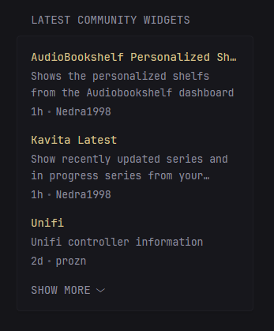

```yml
- type: custom-api
  title: Latest Community Widgets
  cache: 1d
  url: https://raw.githubusercontent.com/glanceapp/community-widgets/refs/heads/main/registry/widgets.json
  template: |
    <ul class="list list-gap-14 collapsible-container" data-collapse-after="3">
      {{ $widgets := .JSON.Array "" | sortByTime "time_added" "rfc3339" "desc" }}
      {{ if gt (len $widgets) 10 }}
        {{ $widgets = slice $widgets 0 10 }}
      {{ end }}
      {{ range $widgets }}
      <li>
        <a class="size-h4 block text-truncate color-primary-if-not-visited" href="https://github.com/glanceapp/community-widgets/blob/main/widgets/{{ .String "directory" }}/README.md" target="_blank" rel="noreferrer">{{ .String "title" }}</a>
        <p class="text-truncate-2-lines margin-top-3">{{ .String "description" }}</p>
        <ul class="list-horizontal-text margin-top-3">
          <li {{ .String "time_added" | parseRelativeTime "rfc3339" }}></li>
          <li>{{ .String "author" }}</li>
        </ul>
      </li>
      {{ end }}
    </ul>
```
