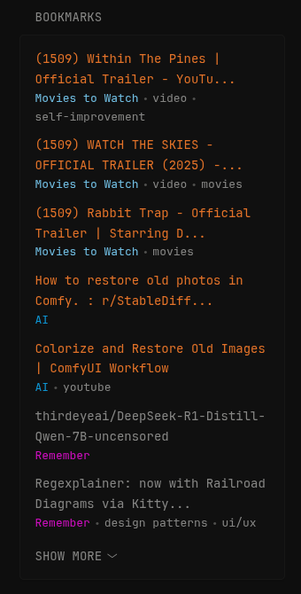

# Linkwarden latest saved links
Simple linkwarden dashboard widget for displaying your most recent bookmarks from Linkwarden with customizable visibility count. Just substitute the following variables:
- `LINKWARDEN_HOST` - your Linkwarden instance URL
- `LINKWARDEN_API_KEY` - your API key from Linkwarden settings
- `LINKS_TO_BE_VISIBLE` - number of links to show before collapsible list

## Preview



## Configuration
```yaml
- type: custom-api
  cache: 30m
  headers:
    Authorization: Bearer <LINKWARDEN_API_KEY>
  method: GET                                                                                     
  template: |
    <ul class="list list-gap-10 collapsible-container" data-collapse-after="<LINKS_TO_BE_VISIBLE>">
      {{ range .JSON.Array "response" }}
        <li>
          {{ $title := .String "name" }}
          {{ if gt (len $title) 50 }}
            {{ $title = (slice $title 0 50) | printf "%s..." }}
          {{ end }}
          <a class="size-title-dynamic color-primary-if-not-visited"
             href="{{ .String "url" }}"
             target="_self"
             rel="noopener noreferrer">
            {{ $title }}
          </a>
          <ul class="list-horizontal-text">
            <li style="color: {{ .String "collection.color" }};">
              {{ .String "collection.name" }}
            </li>
            {{ $tags := .Array "tags" }}
            {{ range $index, $tag := $tags }}
              <li>{{ .String "name" }}</li>
            {{ end }}
          </ul>
        </li>
      {{ end }}
    </ul>
  title: Bookmarks
  url: http://<LINKWARDEN_HOST>/api/v1/links
```
