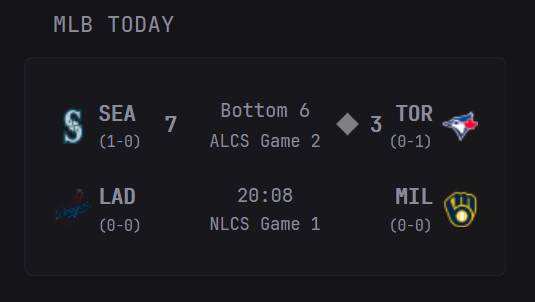

## Preview




## Configuration

```yaml
- type: custom-api
  title: MLB Today
  url: "https://statsapi.mlb.com/api/v1/schedule/games/?sportId=1&hydrate=linescore(runners),team"
  cache: 15s
  template: |
    {{ $dates := .JSON.Array "dates" }}
    {{ if eq (len $dates) 0 }}
      <div style="padding:8px;text-align:center;">No games scheduled today.</div>
    {{ else }}
      {{ $games := (index $dates 0).Array "games" }}
      {{ $wid := printf "mlb-%d" now.UnixNano }}
      <div id="{{ $wid }}" style="position:relative;padding-bottom:{{ if gt (len $games) 6 }}25px{{ else }}0px{{ end }};">
        <input type="checkbox" id="{{ $wid }}-cb" style="display:none"/>
        <ul class="visible" style="list-style:none;padding:0;margin:0;">
          {{ $count := 0 }}
          {{ range $i, $g := $games }}
            {{ $abs := $g.String "status.abstractGameState" }}
            {{ if and (lt $count 6) (eq $abs "Live") }}
              {{ template "row" $g }}
              {{ $count = add $count 1 }}
            {{ end }}
          {{ end }}
          {{ range $i, $g := $games }}
            {{ $abs := $g.String "status.abstractGameState" }}
            {{ if and (lt $count 6) (eq $abs "Preview") }}
              {{ template "row" $g }}
              {{ $count = add $count 1 }}
            {{ end }}
          {{ end }}
          {{ range $i, $g := $games }}
            {{ $abs := $g.String "status.abstractGameState" }}
            {{ if and (lt $count 6) (ne $abs "Live") (ne $abs "Preview") }}
              {{ template "row" $g }}
              {{ $count = add $count 1 }}
            {{ end }}
          {{ end }}
        </ul>
        <ul class="all" style="list-style:none;padding:0;margin:0;display:none">
          {{ range $i, $g := $games }}
            {{ if eq ($g.String "status.abstractGameState") "Live" }}
              {{ template "row" $g }}
            {{ end }}
          {{ end }}
          {{ range $i, $g := $games }}
            {{ if eq ($g.String "status.abstractGameState") "Preview" }}
              {{ template "row" $g }}
            {{ end }}
          {{ end }}
          {{ range $i, $g := $games }}
            {{ $abs := $g.String "status.abstractGameState" }}
            {{ if and (ne $abs "Live") (ne $abs "Preview") }}
              {{ template "row" $g }}
            {{ end }}
          {{ end }}
        </ul>
        {{ if gt (len $games) 6 }}
          <label for="{{ $wid }}-cb" style="position:absolute;bottom:0px;right:0;cursor:pointer;color:var(--glance-accent-color);font-size:16px;padding:5px;">
            <span style="display:inline-block;transition:transform .2s;font-size:20px;">&#9662;</span>
          </label>
        {{ end }}
        <style>
          #{{ $wid }}-cb:not(:checked) ~ .all  { display:none!important }
          #{{ $wid }}-cb:checked   ~ .visible { display:none!important }
          #{{ $wid }}-cb:checked   ~ .all     { display:block!important }
          #{{ $wid }}-cb:checked   ~ label span { transform:rotate(180deg)!important }
        </style>
      </div>
    {{ end }}
    {{ define "row" }}
      {{/* --- AWAY SIDE --- */}}
      {{ $awayAbr  := .String "teams.away.team.abbreviation" }}
      {{ $awayCode := .String "teams.away.team.fileCode" }}
      {{ $awayRecW := .Int    "teams.away.leagueRecord.wins" }}
      {{ $awayRecL := .Int    "teams.away.leagueRecord.losses" }}
      {{ $awaySc   := .Int    "teams.away.score" }}
      {{ $awayId   := .Int    "teams.away.team.id" }}
      {{/* --- HOME SIDE --- */}}
      {{ $homeAbr  := .String "teams.home.team.abbreviation" }}
      {{ $homeCode := .String "teams.home.team.fileCode" }}
      {{ $homeRecW := .Int    "teams.home.leagueRecord.wins" }}
      {{ $homeRecL := .Int    "teams.home.leagueRecord.losses" }}
      {{ $homeSc   := .Int    "teams.home.score" }}
      {{ $homeId   := .Int    "teams.home.team.id" }}
      {{/* status & linescore */}}
      {{ $abs             := .String "status.abstractGameState" }}
      {{ $detailed        := .String "status.detailedState" }}
      {{ $live            := eq $abs "Live" }}
      {{ $inningSt        := .String "linescore.inningState" }}
      {{ $inningN         := .Int    "linescore.currentInning" }}
      {{ $seriesDesc      := .String "seriesDescription" }}
      {{ $seriesLabel     := .String "description" }}
      {{ $seriesGame      := .Int    "seriesGameNumber" }}
      {{ $isRegularSeries := or (eq $seriesDesc "Regular Season") (eq $seriesDesc "Regular Season 1") (eq $seriesDesc "Regular Season 2") (eq $seriesDesc "Regular Season 3") (eq $seriesDesc "Regular Season 4") }}
      {{ $isPlayoffSeries := and (ne $seriesDesc "") (not $isRegularSeries) }}
      {{/* offense & base occupancy */}}
      {{ $r1        := .Exists "linescore.offense.first" }}
      {{ $r2        := .Exists "linescore.offense.second" }}
      {{ $r3        := .Exists "linescore.offense.third" }}
      {{ $offTeamId := .Int    "linescore.offense.team.id" }}
      <li style="display:flex;flex-direction:column;gap:6px;padding:8px 0;border-bottom:1px solid var(--glance-divider);white-space:normal;"
          {{ if ne $abs "Preview" }}
            title="{{ $awayAbr }} Box:{{ range $i, $inning := (.Array "linescore.innings") }}
              {{ if lt $i 9 }}  Inning {{ add $i 1 }}: {{ $inning.Int "away.runs" }}{{ else }}  Inning {{ add $i 1 }}: {{ $inning.Int "away.runs" }}{{ end }}
            {{ end }}&#10;{{ $homeAbr }} Box:{{ range $i, $inning := (.Array "linescore.innings") }}
              {{ if lt $i 9 }}  Inning {{ add $i 1 }}: {{ $inning.Int "home.runs" }}{{ else }}  Inning {{ add $i 1 }}: {{ $inning.Int "home.runs" }}{{ end }}
                                                                                                                                                                                                                                                                                                                                                                                                                                                                                                                                                                                                                                                                                                                                                                                                                                                                                                                                                                                                                                          {{ end }}"
          {{ end }}>
        <div style="display:flex;align-items:center;gap:12px;">
          <span style="display:flex;align-items:center;width:80px;white-space:nowrap;">
            
            <span style="display:flex;flex-direction:column;margin-right:4px;">
              <span style="font-weight:bold;">{{ $awayAbr }}</span>
              <span style="font-size:0.7em;color:var(--glance-muted-text)">
                ({{ printf "%d-%d" $awayRecW $awayRecL }})
              </span>
            </span>
            {{ if ne $abs "Preview" }}
              <span style="margin-left:auto;font-size:1em;font-weight:700;font-variant-numeric:tabular-nums;color:var(--glance-heading-text);">{{ $awaySc }}</span>
            {{ end }}
            {{ if and $live (eq $offTeamId $awayId) }}
              <svg width="20" height="20" viewBox="0 0 24 24" style="margin-left:4px;flex-shrink:0;">
                <rect x="6" y="6" width="12" height="12" fill="#808080" transform="rotate(45 12 12)"/>
                {{ if $r1 }}<circle cx="17" cy="12" r="2.5" fill="white"/>{{ end }}
                {{ if $r2 }}<circle cx="12" cy="7" r="2.5" fill="white"/>{{ end }}
                {{ if $r3 }}<circle cx="7" cy="12" r="2.5" fill="white"/>{{ end }}
              </svg>
            {{ end }}
          </span>
        <span style="text-align:center;width:90px;display:flex;flex-direction:column;align-items:center;justify-content:center;gap:1px;font-size:0.9em;white-space:nowrap;">
          {{ if eq $abs "Preview" }}
            {{ $gameTime := (.String "gameDate" | parseTime "2006-01-02T15:04:05Z").In now.Location }}
            <span style="color:var(--glance-muted-text)">{{ printf "%02d:%02d" $gameTime.Hour $gameTime.Minute }}</span>
          {{ else if $live }}
            <span style="font-weight:500;">{{ printf "%s %d" $inningSt $inningN }}</span>
          {{ else if or (eq $detailed "Game Over") (eq $detailed "Final") }}
            <span style="font-size:1.1em;font-weight:500;">Final</span>
          {{ else }}
            <span>{{ $detailed }}</span>
          {{ end }}
          {{ if $isPlayoffSeries }}
            <span style="font-size:0.9em;color:var(--glance-accent-color);margin-top:0;">
              {{ if $seriesLabel }}
                {{ $seriesLabel }}
              {{ else if gt $seriesGame 0 }}
                {{ printf "%s (Game %d)" $seriesDesc $seriesGame }}
              {{ else }}
                {{ $seriesDesc }}
              {{ end }}
            </span>
          {{ end }}
        </span>
          <span style="display:flex;align-items:center;width:80px;justify-content:flex-end;white-space:nowrap;">
            {{ if and $live (eq $offTeamId $homeId) }}
              <svg width="20" height="20" viewBox="0 0 24 24" style="margin-right:4px;flex-shrink:0;">
                <rect x="6" y="6" width="12" height="12" fill="#808080" transform="rotate(45 12 12)"/>
                {{ if $r1 }}<circle cx="17" cy="12" r="2.5" fill="white"/>{{ end }}
                {{ if $r2 }}<circle cx="12" cy="7" r="2.5" fill="white"/>{{ end }}
                {{ if $r3 }}<circle cx="7" cy="12" r="2.5" fill="white"/>{{ end }}
              </svg>
            {{ end }}
            {{ if ne $abs "Preview" }}
              <span style="margin-left:auto;font-size:1em;font-weight:700;font-variant-numeric:tabular-nums;color:var(--glance-heading-text);">{{ $homeSc }}</span>
            {{ end }}
            <span style="display:flex;flex-direction:column;margin-left:4px;text-align:right;">
              <span style="font-weight:bold;">{{ $homeAbr }}</span>
              <span style="font-size:0.7em;color:var(--glance-muted-text)">
                ({{ printf "%d-%d" $homeRecW $homeRecL }})
              </span>
            </span>
            
          </span>
        </div>
      </li>
    {{ end }}
     ```
