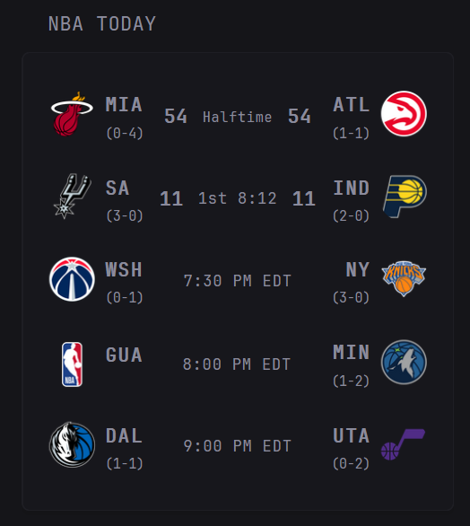

## Preview



## Configuration

```yaml
- type: custom-api
  title: NBA Today
  url: "https://site.api.espn.com/apis/site/v2/sports/basketball/nba/scoreboard"
  cache: 15s
  template: |
    {{ $events := .JSON.Array "events" }}
    {{ if eq (len $events) 0 }}
      <div>No games scheduled today.</div>
    {{ else }}
      {{ $wid := printf "nba-%d" now.UnixNano }}
      <div id="{{ $wid }}" style="position:relative;padding-bottom:{{ if gt (len $events) 6 }}25px{{ else }}0px{{ end }};">
        <input type="checkbox" id="{{ $wid }}-cb" style="display:none"/>
        <ul class="visible" style="list-style:none;padding:0;margin:0;">
          {{ $count := 0 }}
          {{ range $i, $g := $events }}
            {{ $phase := $g.String "competitions.0.status.type.state" }}
            {{ if and (lt $count 6) (eq $phase "in") }}
              {{ template "nba-game" $g }}
              {{ $count = add $count 1 }}
            {{ end }}
          {{ end }}
          {{ range $i, $g := $events }}
            {{ $phase := $g.String "competitions.0.status.type.state" }}
            {{ if and (lt $count 6) (eq $phase "pre") }}
              {{ template "nba-game" $g }}
              {{ $count = add $count 1 }}
            {{ end }}
          {{ end }}
          {{ range $i, $g := $events }}
            {{ $phase := $g.String "competitions.0.status.type.state" }}
            {{ if and (lt $count 6) (and (ne $phase "in") (ne $phase "pre")) }}
              {{ template "nba-game" $g }}
              {{ $count = add $count 1 }}
            {{ end }}
          {{ end }}
        </ul>
      
        <ul class="all" style="list-style:none;padding:0;margin:0;display:none">
          {{ range $i, $g := $events }}
            {{ if eq ($g.String "competitions.0.status.type.state") "in" }}
              {{ template "nba-game" $g }}
            {{ end }}
          {{ end }}
          {{ range $i, $g := $events }}
            {{ if eq ($g.String "competitions.0.status.type.state") "pre" }}
              {{ template "nba-game" $g }}
            {{ end }}
          {{ end }}
          {{ range $i, $g := $events }}
            {{ $phase := $g.String "competitions.0.status.type.state" }}
            {{ if and (ne $phase "in") (ne $phase "pre") }}
              {{ template "nba-game" $g }}
            {{ end }}
          {{ end }}
        </ul>
      
        {{ if gt (len $events) 6 }}
          <label for="{{ $wid }}-cb" style="position:absolute;bottom:0px;right:0;cursor:pointer;color:var(--glance-accent-color);font-size:16px;padding:5px;">
            <span style="display:inline-block;transition:transform .2s;font-size:20px;">&#9662;</span>
          </label>
        {{ end }}
        <style>
          #{{ $wid }} .nba-row:last-child { margin-bottom:0; }
          #{{ $wid }}-cb:not(:checked) ~ .all { display:none!important }
          #{{ $wid }}-cb:checked ~ .visible { display:none!important }
          #{{ $wid }}-cb:checked ~ .all { display:block!important }
          #{{ $wid }}-cb:checked ~ label span { transform:rotate(180deg)!important }
        </style>
      </div>
    {{ end }}

    {{ define "nba-game" }}
      {{ $state := .String "competitions.0.status.type.name" }}
      {{ $home := index (.Array "competitions.0.competitors") 0 }}
      {{ $away := index (.Array "competitions.0.competitors") 1 }}
      {{ $awayRecords := $away.Array "records" }}
      {{ $homeRecords := $home.Array "records" }}
      {{ $awayRec := "" }}
      {{ if gt (len $awayRecords) 0 }}{{ $awayRec = (index $awayRecords 0).String "summary" }}{{ end }}
      {{ $homeRec := "" }}
      {{ if gt (len $homeRecords) 0 }}{{ $homeRec = (index $homeRecords 0).String "summary" }}{{ end }}
      {{ $awayLogo := $away.String "team.logo" }}
      {{ $homeLogo := $home.String "team.logo" }}
      {{ $fallbackLogo := "https://a.espncdn.com/combiner/i?img=/i/teamlogos/leagues/500/nba.png" }}
      {{ $statusText := .String "competitions.0.status.type.shortDetail" }}
      {{ $statusFont := "0.7em" }}
      {{ if eq $state "STATUS_IN_PROGRESS" }}{{ $statusFont = "0.8em" }}{{ end }}
      {{ if eq $state "STATUS_SCHEDULED" }}{{ $statusFont = "0.8em" }}{{ end }}
      {{ if eq $statusText "Final" }}{{ $statusFont = "0.8em" }}{{ end }}
      {{ $awayAbbr := $away.String "team.abbreviation" }}
      {{ if or (eq (len $awayAbbr) 0) (gt (len $awayAbbr) 3) }}
        {{ $awayAbbr = printf "%.3s" ($away.String "team.displayName") }}
      {{ end }}
      {{ $homeAbbr := $home.String "team.abbreviation" }}
      {{ if or (eq (len $homeAbbr) 0) (gt (len $homeAbbr) 3) }}
        {{ $homeAbbr = printf "%.3s" ($home.String "team.displayName") }}
      {{ end }}
      <li class="nba-row" style="display:flex;flex-direction:column;gap:4px;padding:10px 0;border-bottom:1px solid var(--glance-divider);" {{ if ne $state "STATUS_SCHEDULED" }}title="{{ $awayAbbr }} Box:{{ range $j,$ls := $away.Array "linescores" }}{{ if eq $j 0 }} Q1: {{ else if eq $j 1 }} Q2: {{ else if eq $j 2 }} Q3: {{ else if eq $j 3 }} Q4: {{ else }} OT: {{ end }}{{ $ls.String "value" }}{{ end }}&#10;{{ $homeAbbr }} Box:{{ range $j,$ls := $home.Array "linescores" }}{{ if eq $j 0 }} Q1: {{ else if eq $j 1 }} Q2: {{ else if eq $j 2 }} Q3: {{ else if eq $j 3 }} Q4: {{ else }} OT: {{ end }}{{ $ls.String "value" }}{{ end }}"{{ end }}>
        <div style="display:flex;align-items:center;justify-content:space-between;gap:12px;min-width:0;">
          <div style="display:flex;align-items:flex-start;gap:6px;min-width:0;">
            {{ if $awayLogo }}
              
            {{ else }}
              
            {{ end }}
            <div style="display:flex;flex-direction:column;gap:2px;min-width:0;">
              <div style="display:flex;align-items:baseline;gap:6px;min-width:0;">
                <span style="font-weight:700;letter-spacing:0.08em;white-space:nowrap;text-transform:uppercase;">{{ $awayAbbr }}</span>
              </div>
              {{ if $awayRec }}<span style="font-size:0.7em;color:var(--glance-muted-text);white-space:nowrap;">({{ $awayRec }})</span>{{ end }}
            </div>
          </div>
        <div style="flex:1;display:flex;align-items:center;justify-content:center;gap:10px;white-space:nowrap;letter-spacing:0.05em;min-width:0;">
          {{ if ne $state "STATUS_SCHEDULED" }}
            <span style="font-size:1em;font-weight:700;font-variant-numeric:tabular-nums;color:var(--glance-heading-text);">{{ $away.String "score" }}</span>
          {{ end }}
          <span style="font-size:{{ $statusFont }};font-weight:500;">
            {{ if eq $state "STATUS_IN_PROGRESS" }}
              {{ $period := .String "competitions.0.status.period" }}
              {{ if eq $period "1" }}1st{{ else if eq $period "2" }}2nd{{ else if eq $period "3" }}3rd{{ else if eq $period "4" }}4th{{ else }}OT{{ end }} {{ .String "competitions.0.status.displayClock" }}
            {{ else if eq $state "STATUS_SCHEDULED" }}
              {{ $tipStr := .String "competitions.0.date" }}
              {{ if $tipStr }}
                {{ $tip := ($tipStr | parseTime "2006-01-02T15:04Z") }}
                {{ $local := $tip.In now.Location }}
                {{ $hour := $local.Hour }}
                {{ $minute := $local.Minute }}
                {{ $ampm := "AM" }}
                {{ if ge $hour 12 }}{{ $ampm = "PM" }}{{ end }}
                {{ $hour12 := $hour }}
                {{ if eq $hour 0 }}
                  {{ $hour12 = 12 }}
                {{ else if gt $hour 12 }}
                  {{ $hour12 = add $hour -12 }}
                {{ end }}
                {{- printf "%d:%02d %s EDT" $hour12 $minute $ampm -}}
              {{ else }}
                {{ $statusText }}
              {{ end }}
            {{ else }}
              {{ $statusText }}
            {{ end }}
          </span>
          {{ if ne $state "STATUS_SCHEDULED" }}
            <span style="font-size:1em;font-weight:700;font-variant-numeric:tabular-nums;color:var(--glance-heading-text);">{{ $home.String "score" }}</span>
          {{ end }}
          {{ if .Exists "competitions.0.series" }}
            <span style="font-size:0.7em;color:var(--glance-muted-text);">{{ .String "competitions.0.series.summary" }}</span>
          {{ end }}
        </div>
          <div style="display:flex;align-items:flex-start;gap:6px;justify-content:flex-end;min-width:0;">
            <div style="display:flex;flex-direction:column;gap:2px;align-items:flex-end;min-width:0;">
              <div style="display:flex;align-items:baseline;gap:6px;min-width:0;">
                <span style="font-weight:700;letter-spacing:0.08em;white-space:nowrap;text-transform:uppercase;">{{ $homeAbbr }}</span>
              </div>
              {{ if $homeRec }}<span style="font-size:0.7em;color:var(--glance-muted-text);white-space:nowrap;">({{ $homeRec }})</span>{{ end }}
            </div>
            {{ if $homeLogo }}
              
            {{ else }}
              
            {{ end }}
          </div>
        </div>
      </li>
    {{ end }}
```
