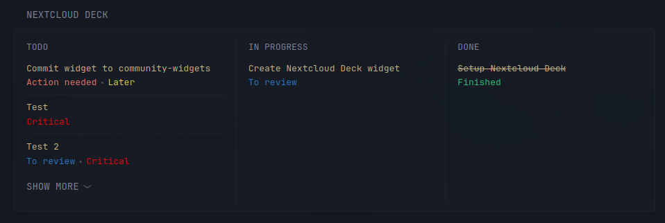

# Nextcloud Deck Widget
This widget displays Deck board with cards and optional labels from Nextcloud.

## Preview


## Env variables
* `NEXTCLOUD_HOST`: HTTP host of your Nextcloud server
* `NEXTCLOUD_AUTH`: Base64 of your username:password pair (`echo -n "username:password" | base64`)

## Options
* `board-id`: ID of the board you want to display
* `show-labels`: Display card labels
* `collapse-after`: Collapse cards after specified amount 

## Code
```yaml
  - type: custom-api
    title: Nextcloud Deck
    cache: 30s
    options:
        board-id: 2
        show-labels: true
        collapse-after: 3
    template: |
        {{ $boardId := .Options.IntOr "board-id" 0 }}
        {{ $showLabels := .Options.BoolOr "show-labels" false }}
        {{ $collapseAfter := .Options.IntOr "collapse-after" 3 }}
        {{
        $deck := newRequest (printf "${NEXTCLOUD_HOST}/index.php/apps/deck/api/v1.1/boards/%d/stacks" $boardId)
            | withHeader "Authorization" "Basic ${NEXTCLOUD_AUTH}"
            | getResponse
        }}
        <div class="dynamic-columns list-gap-20 list-with-separator margin-bottom-10">
        {{ range sortByInt "order" "asc" ($deck.JSON.Array "") }}
            <div class="shrink-0">
            <h2 class="uppercase margin-bottom-10">{{ .String "title" }}</h3>
            <ul class="list list-gap-14 collapsible-container list-with-separator" data-collapse-after="{{ $collapseAfter }}">
                {{ range sortByInt "order" "asc" (.Array "cards") }}
                <li>
                    <a 
                    style="{{ if .String "done" }}text-decoration: line-through;{{ end }}"
                    href="{{ printf "${NEXTCLOUD_HOST}/apps/deck/board/%d/card/%d" $boardId (.Int "id") }}" 
                    class="color-primary" 
                    target="_blank" 
                    rel="noreferrer">{{ .String "title" }}</a>
                    {{ if $showLabels }}
                    <ul class="list-horizontal-text flex-nowrap">
                        {{ range .Array "labels" }}
                        <li style="color: #{{ .String "color" }};">{{ .String "title" }}</li>
                        {{ end }}
                    </ul>
                    {{ end }}
                </li>
                {{ end }}
            </ul>
            </div>
        {{ end }}
        </div>
```