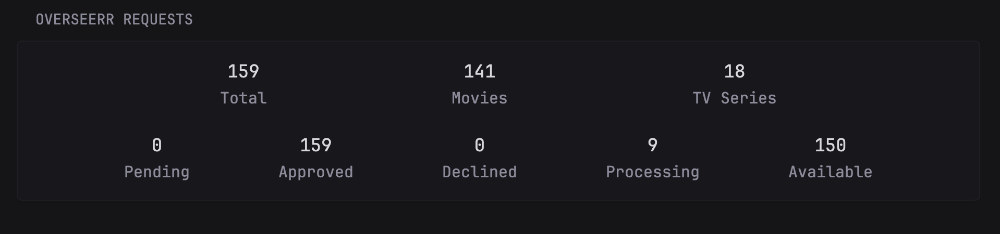
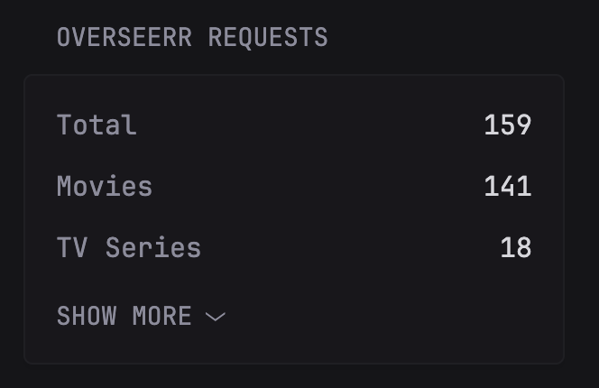

# Overseerr Requests Stats

* [Introduction](#introduction)
* [Preview](#preview)
* [Configuration](#configuration)
  * [Environment Variables](#environment-variables)
  * [Customization](#customization)
* [Widget YAML](#widget-yaml)
* [Gallery](#gallery)

## Introduction

Shows the total requests made in Overseerr, divided by media types (movies and TV series) and by their current status (pending, approved, declined, processing and available).

## Preview



## Configuration

### Environment Variables

* `OVERSEERR_API_URL`: the URL of the Overseerr instance. Include `http://` or `https://`.
* `OVERSEERR_API_KEY`: the API key of the server which can be found in _Settings > General > API key_

### Customization

Customize the widget appearance by editing these options:

| Name         | Type    | Required | Default | Description |
| ------------ | ------- | -------- | ------- |------------ |
| small-column | boolean | no       | false   | Set to true if used in a small column |
| compact      | boolean | no       | false   | Set to true to make the widget more compact and the font size smaller |

## Widget YAML

```yaml
- type: custom-api
  title: Overseerr Requests
  title-url: ${OVERSEERR_API_URL}/requests
  url: ${OVERSEERR_API_URL}/api/v1/request/count
  cache: 1h
  options:
    small-column: true
    compact: false
  headers:
    accept: "application/json"
    x-api-key: ${OVERSEERR_API_KEY}
  template: |  
    {{ $isSmallColumn := .Options.BoolOr "small-column" false }}
    {{ $isCompact := .Options.BoolOr "compact" false }}

    {{ if eq .Response.StatusCode 200 }}
      {{ if $isSmallColumn }}
        <ul class="list list-gap-10 collapsible-container" data-collapse-after="3">
          <li class="flex items-start gap-10">
            <div class="flex-1 size-h3 {{ if $isCompact }}size-h5{{ end }}">Total</div>
            <div class="flex-1 color-highlight shrink-0 text-right size-h3 {{ if $isCompact }}size-h5{{ end }}">
              {{ .JSON.Int "total" | formatNumber }}
            </div>
          </li>
          <li class="flex items-start gap-10">
            <div class="flex-1 size-h3 {{ if $isCompact }}size-h5{{ end }}">Movies</div>
            <div class="flex-1 color-highlight shrink-0 text-right size-h3 {{ if $isCompact }}size-h5{{ end }}">
              {{ .JSON.Int "movie" | formatNumber }}
            </div>
          </li>
          <li class="flex items-start gap-10">
            <div class="flex-1 size-h3 {{ if $isCompact }}size-h5{{ end }}">TV Series</div>
            <div class="flex-1 color-highlight shrink-0 text-right size-h3 {{ if $isCompact }}size-h5{{ end }}">
              {{ .JSON.Int "tv" | formatNumber }}
            </div>
          </li>
          <li class="flex items-start gap-10">
            <div class="flex-1 size-h3 {{ if $isCompact }}size-h5{{ end }}">Pending</div>
            <div class="flex-1 color-highlight shrink-0 text-right size-h3 {{ if $isCompact }}size-h5{{ end }}">
              {{ .JSON.Int "pending" | formatNumber }}
            </div>
          </li>
          <li class="flex items-start gap-10">
            <div class="flex-1 size-h3 {{ if $isCompact }}size-h5{{ end }}">Approved</div>
            <div class="flex-1 color-highlight shrink-0 text-right size-h3 {{ if $isCompact }}size-h5{{ end }}">
              {{ .JSON.Int "approved" | formatNumber }}
            </div>
          </li>
          <li class="flex items-start gap-10">
            <div class="flex-1 size-h3 {{ if $isCompact }}size-h5{{ end }}">Declined</div>
            <div class="flex-1 color-highlight shrink-0 text-right size-h3 {{ if $isCompact }}size-h5{{ end }}">
              {{ .JSON.Int "declined" | formatNumber }}
            </div>
          </li>
          <li class="flex items-start gap-10">
            <div class="flex-1 size-h3 {{ if $isCompact }}size-h5{{ end }}">Processing</div>
            <div class="flex-1 color-highlight shrink-0 text-right size-h3 {{ if $isCompact }}size-h5{{ end }}">
              {{ .JSON.Int "processing" | formatNumber }}
            </div>
          </li>
          <li class="flex items-start gap-10">
            <div class="flex-1 size-h3 {{ if $isCompact }}size-h5{{ end }}">Available</div>
            <div class="flex-1 color-highlight shrink-0 text-right size-h3 {{ if $isCompact }}size-h5{{ end }}">
              {{ .JSON.Int "available" | formatNumber }}
            </div>
          </li>
        </ul>
      {{ else }} 
        <div class="flex justify-evenly text-center">
          <div>
              <div class="color-highlight size-h1 {{ if $isCompact }}size-h3{{ end }}">{{ .JSON.Int "total" | formatNumber }}</div>
              <div class="size-h3 {{ if $isCompact }}size-h5{{ end }}">Total</div>
          </div>
          <div>
              <div class="color-highlight size-h1 {{ if $isCompact }}size-h3{{ end }}">{{ .JSON.Int "movie" | formatNumber }}</div>
              <div class="size-h3 {{ if $isCompact }}size-h5{{ end }}">Movies</div>
          </div>
          <div>
              <div class="color-highlight size-h1 {{ if $isCompact }}size-h3{{ end }}">{{ .JSON.Int "tv" | formatNumber }}</div>
              <div class="size-h3 {{ if $isCompact }}size-h5{{ end }}">TV Series</div>
          </div>
        {{ if not $isCompact }}
          </div>
          <div class="flex justify-evenly text-center margin-top-20">        
        {{ end }}
          <div>
              <div class="color-highlight size-h1 {{ if $isCompact }}size-h3{{ end }}">{{ .JSON.Int "pending" | formatNumber }}</div>
              <div class="size-h3 {{ if $isCompact }}size-h5{{ end }}">Pending</div>
          </div>
          <div>
              <div class="color-highlight size-h1 {{ if $isCompact }}size-h3{{ end }}">{{ .JSON.Int "approved" | formatNumber }}</div>
              <div class="size-h3 {{ if $isCompact }}size-h5{{ end }}">Approved</div>
          </div>
          <div>
              <div class="color-highlight size-h1 {{ if $isCompact }}size-h3{{ end }}">{{ .JSON.Int "declined" | formatNumber }}</div>
              <div class="size-h3 {{ if $isCompact }}size-h5{{ end }}">Declined</div>
          </div>
          <div>
              <div class="color-highlight size-h1 {{ if $isCompact }}size-h3{{ end }}">{{ .JSON.Int "processing" | formatNumber }}</div>
              <div class="size-h3 {{ if $isCompact }}size-h5{{ end }}">Processing</div>
          </div>
          <div>
              <div class="color-highlight size-h1 {{ if $isCompact }}size-h3{{ end }}">{{ .JSON.Int "available" | formatNumber }}</div>
              <div class="size-h3 {{ if $isCompact }}size-h5{{ end }}">Available</div>
          </div>  
        </div>   
      {{ end }}
    {{ end }}
```

## Gallery



