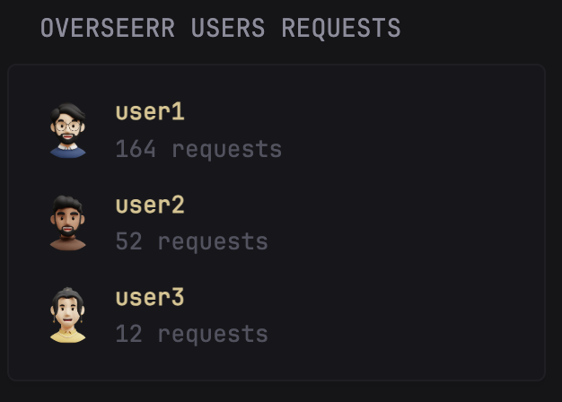

# Overseerr Users Requests

* [Introduction](#introduction)
* [Preview](#preview)
* [Configuration](#configuration)
  * [Environment Variables](#environment-variables)
  * [Customization](#customization)
* [Widget YAML](#widget-yaml)

## Introduction

Shows a leaderboard of the Overseerr users ordered by the number of requestes done.

## Preview



## Configuration

### Environment Variables

* `OVERSEERR_API_URL`: the URL of the Overseerr instance. Include `http://` or `https://`.
* `OVERSEERR_API_KEY`: the API key of the server which can be found in _Settings > General > API key_

### Customization

Customize the widget appearance by editing these options:

| Name           | Type    | Required | Default | Description |
| -------------- | ------- | -------- | ------- |------------ |
| max-users      | int     | no       | 10      | Maximum number of users to get from the API |
| collapse-after | int     | no       | 5       | How many users to show when the list is collapsed |

## Widget YAML

```yaml
- type: custom-api
  title: Overseerr Users Requests
  title-url: ${OVERSEERR_API_URL}/users
  cache: 1h
  options:
    collapse-after: 5
    max-users: 10
    api-base-url: ${OVERSEERR_API_URL}/api/v1
    api-key: ${OVERSEERR_API_KEY}
  template: |
    {{ $collapseAfter := .Options.IntOr "collapse-after" 5 }}
    {{ $maxUsers := .Options.IntOr "max-users" 10 }}
    {{ $apiBaseUrl := .Options.StringOr "api-base-url" "" }}
    {{ $apiKey := .Options.StringOr "api-key" "" }}

    {{ $listUsersUrl := printf "%s/user?sort=requests&take=%d" $apiBaseUrl $maxUsers }}
    {{ $users := newRequest $listUsersUrl 
      | withHeader "Accept" "application/json"
      | withHeader "X-Api-Key" $apiKey
      | getResponse }}

    <ul class="list list-gap-10 collapsible-container" data-collapse-after="{{ $collapseAfter }}">
      {{ range $users.JSON.Array "results" }}
        {{ $userId := .String "id" }}
        {{ $username := .String "displayName" }}
        {{ if eq $username "" }}{{ $username = .String "username" }}{{ end }}
        {{ $avatar := .String "avatar" }}

        {{ $usersRequestsUrl := printf "%s/user/%s/requests?take=1" $apiBaseUrl $userId }}
        {{ $stats := newRequest $usersRequestsUrl
          | withHeader "Accept" "application/json"
          | withHeader "X-Api-Key" $apiKey
          | getResponse }}
        
        {{ $requestCount := $stats.JSON.Int "pageInfo.results" }}

        <li class="flex items-center gap-10">
          
          <div class="shrink min-width-0">
            <strong class="block text-truncate color-primary">{{ $username }}</strong>
            <div class="size-small color-subdue">
              {{ $requestCount }} {{ if eq $requestCount 1 }}request{{ else }}requests{{ end }}
            </div>
          </div>
        </li>
      {{ end }}

      {{ if eq (len ($users.JSON.Array "results")) 0 }}
        <li>No users found. Check your API URL and Key.</li>
      {{ end }}
    </ul>
```
