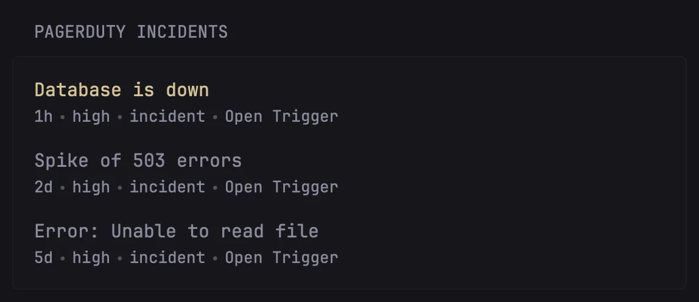
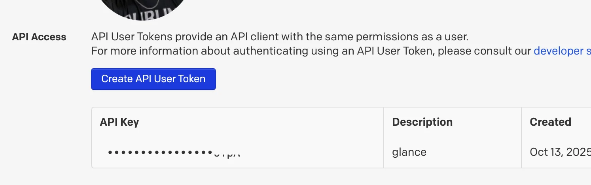

# PagerDuty Incidents

Shows the latest Incidents that are still open from [PagerDuty](http://pagerduty.com/).

Useful to glance and quickly keep an eye on the latest incidents.

## Preview



## How to use

Generate a [User Token REST API Key](https://support.pagerduty.com/main/docs/api-access-keys#generate-a-user-token-rest-api-key).
You can do that from by visiting your Profile -> User Settings.



Make the token available as an environmental variable, called `PAGERDUTY_TOKEN`,
or if you just want to test it out replace the `${PAGERDUTY_TOKEN}` in the code.

Then copy-paste this code and add it to your Glance configuration:

```yaml
- type: custom-api
  title: PagerDuty Incidents
  cache: 5m
  url: https://api.pagerduty.com/incidents?limit=10&statuses[]=triggered&statuses[]=acknowledged&sort_by=urgency,created_at
  headers:
    Authorization: Token token=${PAGERDUTY_TOKEN}
    Accept: application/json
  template: |
    <ul class="list list-gap-14 collapsible-container" data-collapse-after="5">
    {{ range.JSON.Array "incidents" }}
      <li>
          <a href="{{ .String "html_url" }}" class="size-title-dynamic {{ if ne (.String "status") "acknowledged" }}color-primary-if-not-visited{{ else }}negative-color{{ end }}" target="_blank" rel="noreferrer">
            {{ .String "title" }}
          </a>
          <ul class="list-horizontal-text flex-nowrap">
            <li class="min-width-0" {{ .String "created_at" | parseTime "rfc3339" | toRelativeTime }}></li>
            <li class="min-width-0">{{ .String "urgency" }}</li>
            <li class="min-width-0">{{ .String "type" }}</li>
            <li class="min-width-0"><a class="visited-indicator text-truncate block" target="_blank" rel="noreferrer" href="{{ .String "first_trigger_log_entry.html_url" }}">Open Trigger</a></li>
          </ul>
      </li>
    {{ end }}
    </ul>
```

It is possible to customize the incidents to show by editing the filters,
sorting and by modifying the URL. For example you can add `teams_ids[]=...` to
the URL query to filter incidents to a specific team; you can also add
`date_range=all`, to show more incidents, and not just the ones from last month
(default API settings).

You can read more about the PagerDuty Incidents API in the
[documentation here](https://developer.pagerduty.com/api-reference/9d0b4b12e36f9-list-incidents).
Have fun with it! :~)
