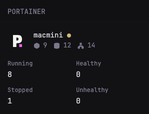

## Portainer Dashboard

A widget to display a dashboard of your portainer services.

### Preview


### Requirements

#### Get the PORTAINER_API_KEY
1. Open your portainer dashboard and go to `Settings` -> `API` -> `Enable API`.
2. Copy the `API Key`.
3. Set the `PORTAINER_API_KEY` environment variable to the API key.


#### Get the PORTAINER_ENDPOINT_ID and PORTAINER_URL
1. Open your portainer dashboard.
2. Copy the browser URL and extract the endpoint ID from the URL. e.g. `http://<your-portainer-url>/#!/2/docker/dashboard` -> `2`
3. Set the `PORTAINER_ENDPOINT_ID` environment variable to the endpoint ID.
4. Set the `PORTAINER_URL` environment variable to the portainer URL. e.g. `http://<your-portainer-url>`

Once the prerequisites and setup are complete, copy the code below and add it to your `glance.yml` file.

```yaml
- type: custom-api
  title: Portainer
  cache: 1h
  url: ${PORTAINER_URL}/api/endpoints/${PORTAINER_ENDPOINT_ID}
  headers:
    X-API-Key: ${PORTAINER_API_KEY}
  template: |
    <style>
      .list-horizontal-text.no-bullets > *:not(:last-child)::after {
          content: none !important;
      }
      .list-horizontal-text.no-bullets > *:not(:last-child) {
        margin-right: 1em;
      }
    </style>
    <div style="display:flex; align-items:center; gap:12px;">
        <div style="width:40px; height:40px; flex-shrink:0; display:flex; justify-content:center; align-items:center; overflow:hidden;">
          
        </div>
        <div style="flex-grow:1; min-width:0;">
          <a class="size-h4 block text-truncate color-highlight">
            {{ .JSON.String "Name" }}
            <span style="width: 8px; height: 8px; border-radius: 50%; background-color: var(--color-positive); display: inline-block; vertical-align: middle;"></span>
          </a>
          <ul class="list-horizontal-text no-bullets">
            <li data-popover-type="text" data-popover-text="Containers: {{ .JSON.Int "Snapshots.0.ContainerCount" }}">
              <p style="display:inline-flex;align-items:center;">
                <svg xmlns="http://www.w3.org/2000/svg" viewBox="0 0 24 24" fill="currentColor" stroke="currentColor" stroke-width="2" stroke-linecap="round" stroke-linejoin="round" style="height:1em;vertical-align:middle;margin-right:0.5em;" class="size-6 lucide lucide-box icon inline-flex" aria-hidden="true" role="img"><path d="M21 8a2 2 0 0 0-1-1.73l-7-4a2 2 0 0 0-2 0l-7 4A2 2 0 0 0 3 8v8a2 2 0 0 0 1 1.73l7 4a2 2 0 0 0 2 0l7-4A2 2 0 0 0 21 16Z"></path><path d="m3.3 7 8.7 5 8.7-5"></path><path d="M12 22V12"></path></svg>
                {{ .JSON.Int "Snapshots.0.ContainerCount" }}
              </p>
            </li>
            <li data-popover-type="text" data-popover-text="Volumes: {{ .JSON.Int "Snapshots.0.VolumeCount" }}">
              <p style="display:inline-flex;align-items:center;">
                <svg xmlns="http://www.w3.org/2000/svg" viewBox="0 0 24 24" fill="currentColor" stroke="currentColor" stroke-width="2" stroke-linecap="round" stroke-linejoin="round" style="height:1em;vertical-align:middle;margin-right:0.5em;" class="size-6 lucide lucide-database icon inline-flex" aria-hidden="true" role="img"><ellipse cx="12" cy="5" rx="9" ry="3"></ellipse><path d="M3 5V19A9 3 0 0 0 21 19V5"></path><path d="M3 12A9 3 0 0 0 21 12"></path></svg>
                {{ .JSON.Int "Snapshots.0.VolumeCount"  }}
              </p>
            </li>
            <li data-popover-type="text" data-popover-text="Networks: {{ .JSON.Int "Snapshots.0.DockerSnapshotRaw.Networks.#" }}">
              <p style="display:inline-flex;align-items:center;">
                <svg xmlns="http://www.w3.org/2000/svg" viewBox="0 0 24 24" fill="currentColor" stroke="currentColor" stroke-width="2" stroke-linecap="round" stroke-linejoin="round" style="height:1em;vertical-align:middle;margin-right:0.5em;" class="size-6 lucide lucide-network icon inline-flex" aria-hidden="true" role="img"><rect x="16" y="16" width="6" height="6" rx="1"></rect><rect x="2" y="16" width="6" height="6" rx="1"></rect><rect x="9" y="2" width="6" height="6" rx="1"></rect><path d="M5 16v-3a1 1 0 0 1 1-1h12a1 1 0 0 1 1 1v3"></path><path d="M12 12V8"></path></svg>
                {{ .JSON.Int "Snapshots.0.DockerSnapshotRaw.Networks.#" }}
              </p>
            </li>
          </ul>
        </div>
    </div>
    <div class="margin-block-2" style="margin-top: 1em">
      <div style="display: grid; grid-template-columns: 1fr 1fr; gap: 10px;">
        <div>
          <div class="size-h5">Running</div>
          <div class="size-h3 color-highlight">{{ .JSON.Int "Snapshots.0.RunningContainerCount" }}</div>
        </div>
        <div>
          <div class="size-h5">Healthy</div>
          <div class="size-h3 color-highlight">{{ .JSON.Int "Snapshots.0.HealthyContainerCount" }}</div>
        </div>
        <div>
          <div class="size-h5">Stopped</div>
          <div class="size-h3 color-highlight">{{ .JSON.Int "Snapshots.0.StoppedContainerCount" }}</div>
        </div>
        <div>
          <div class="size-h5">Unhealthy</div>
          <div class="size-h3 color-highlight">{{ .JSON.Int "Snapshots.0.DockerSnapshotRaw.Containers.#(Health=\"unhealthy\").#" }}</div>
        </div>
      </div>
    </div>
```