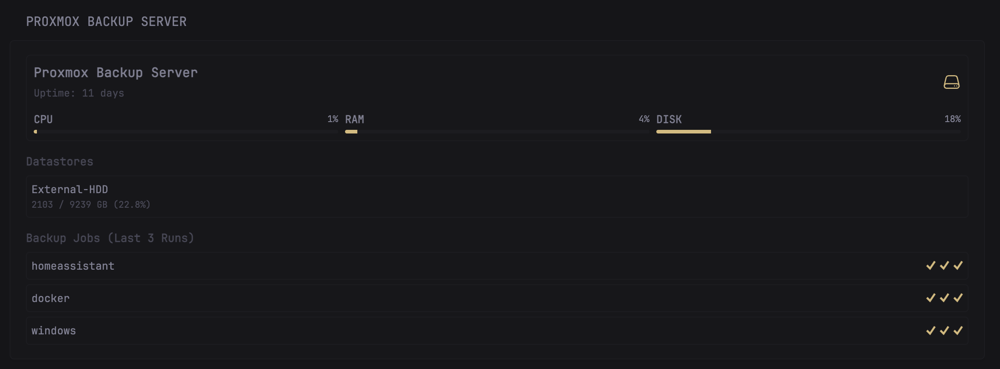

## Proxmox Backup Server - Complete Dashboard Widget

This comprehensive widget displays detailed information about your Proxmox Backup Server including system status, datastore usage, and backup job history. It automatically detects all VMs with backups and shows their success/failure status with visual indicators.

### Features:
- **Server Status**: CPU, RAM, and disk usage with color-coded progress bars
- **Uptime Display**: Shows server uptime in days
- **Datastore Overview**: Lists all datastores with usage statistics
- **Backup Job History**: Displays the last 3 backup runs for each VM
- **Automatic VM Detection**: No hardcoded VM IDs required
- **VM Name Resolution**: Fetches VM names from Proxmox VE API
- **Visual Status Indicators**: ✓ for success, ✗ for failure

### Required Environment Variables:

#### For Proxmox Backup Server:
- `PBS_HOST` = Your Proxmox Backup Server URL (without http/https prefix, e.g., `pbs.example.com:8007`)
- `PBS_TOKEN` = Your PBS API token in format: `PBSAPIToken=user@realm!tokenname:secret`

#### For Proxmox VE (for VM name resolution):
- `PROXMOXVE_URL` = Your Proxmox VE URL (without http/https prefix, e.g., `pve.example.com:8006`)
- `PROXMOXVE_KEY` = Your PVE API token secret (format: `user@realm!tokenname:secret`)

> [!IMPORTANT]
> **Easy Setup**: If you already have the [official Proxmox VE widget](https://github.com/glanceapp/glance/blob/main/docs/widgets.md#proxmox) installed, the `PROXMOXVE_URL` and `PROXMOXVE_KEY` variables are already available! You only need to create the PBS-specific variables (`PBS_HOST` and `PBS_TOKEN`).
>
> If you don't have the Proxmox VE widget installed, you'll need to manually create all four environment variables.

### Authentication Setup

#### Creating PBS API Token:
1. Log into your Proxmox Backup Server web interface
2. Navigate to **Configuration** → **Access Control** → **API Tokens**
3. Click **Add** to create a new token
4. Set **User** to your user (e.g., `root@pam`)
5. Enter a **Token ID** (e.g., `glance`)
6. Uncheck **Privilege Separation** if you want full access
7. Click **Add** and copy the generated secret
8. Format your token as: `PBSAPIToken=root@pam!glance:your-secret-here`

#### Creating PVE API Token (if not using Proxmox VE widget):
1. Log into your Proxmox VE web interface
2. Navigate to **Datacenter** → **Permissions** → **API Tokens**
3. Click **Add** to create a new token
4. Set **User** to your user (e.g., `root@pam`)
5. Enter a **Token ID** (e.g., `glance`)
6. Uncheck **Privilege Separation** if you want full access
7. Click **Add** and copy the generated secret
8. Format as: `root@pam!glance:your-secret-here`

### Environment File (.env)

Create or update your `.env` file in your Glance directory:

Proxmox Backup Server
PBS_HOST=pbs.example.com:8007PBS_TOKEN=PBSAPIToken=root@pam!glance:xxxxxxxx-xxxx-xxxx-xxxx-xxxxxxxxxxxx

Proxmox VE (if not already configured)
PROXMOXVE_URL=pve.example.com:8006PROXMOXVE_KEY=root@pam!glance:xxxxxxxx-xxxx-xxxx-xxxx-xxxxxxxxxxxx

### Troubleshooting

**Widget shows "Failed to connect to PBS":**
- Verify your `PBS_HOST` and `PBS_TOKEN` environment variables are correct
- Check that `allow-insecure: true` is set if using self-signed certificates
- Ensure your PBS server is reachable from the Glance container
- Verify the API token has proper permissions

**VM names show as worker IDs (e.g., "External-HDD:vm/103"):**
- The PVE API connection may be failing
- Verify the `PROXMOXVE_URL` and `PROXMOXVE_KEY` environment variables
- Check that the Proxmox VE API token has read permissions for cluster resources

**No backup jobs are shown:**
- The widget only shows backup tasks from the PBS task list
- Verify backups are actually running and appear in PBS task history
- Check if the backup job worker_type is "backup" in the PBS API response

**Datastores not appearing:**
- Ensure the PBS user/token has permissions to view datastore information
- Check PBS logs for API access errors

> [!WARNING]  
> If you're using self-signed TLS certificates with Glance, make sure to include these lines in your `docker-compose.yml`:

```yaml
volumes:
  - ./glance.yml:/app/glance.yml
  - /path/to/rootCA.pem:/usr/local/share/ca-certificates/rootCA.crt:ro
environment:
  - SSL_CERT_FILE=/usr/local/share/ca-certificates/rootCA.crt
env_file: .env
```

### Preview

The widget displays:
- Server name and uptime
- CPU, RAM, and Disk usage with color-coded progress bars (green < 70%, orange < 90%, red ≥ 90%)
- All configured datastores with their usage statistics
- Last 3 backup runs for each VM with visual success/failure indicators
- Automatic detection of all VMs with backups (no configuration required)

### Installation

Add the following configuration to your `glance.yml` file:
```yaml
- type: custom-api
  title: Proxmox Backup Server
  cache: 5m
  allow-insecure: true
  options:
    uptime-mode: duration  # relative | duration
    collapse-after: 5
  template: |
    {{ $statusRes := newRequest "https://${PBS_HOST}/api2/json/nodes/localhost/status" | withHeader "Authorization" "${PBS_TOKEN}" | getResponse }}
    {{ $datastoresRes := newRequest "https://${PBS_HOST}/api2/json/status/datastore-usage" | withHeader "Authorization" "${PBS_TOKEN}" | getResponse }}
    {{ $tasksRes := newRequest "https://${PBS_HOST}/api2/json/nodes/localhost/tasks" | withHeader "Authorization" "${PBS_TOKEN}" | getResponse }}
    {{ $pveVMs := newRequest "https://${PROXMOXVE_URL}/api2/json/cluster/resources?type=vm" | withHeader "Authorization" "PVEAPIToken=${PROXMOXVE_KEY}" | getResponse }}
    
    {{ if eq $statusRes.Response.StatusCode 200 }}
      {{ $data := $statusRes.JSON.Get "data" }}
      {{ $cpuUsage := mul ($data.Float "cpu") 100.0 }}
      {{ $memPercent := mul (div ($data.Float "memory.used") ($data.Float "memory.total")) 100.0 }}
      {{ $rootPercent := mul (div ($data.Float "root.used") ($data.Float "root.total")) 100.0 }}
      {{ $uptimeSec := $data.Float "uptime" }}
      {{ $uptimeDays := div $uptimeSec 86400.0 }}
      
      <div class="pbs-container">
        <style>
          .pbs-container { display: flex; flex-direction: column; gap: 0.75rem; }
          .pbs-server { display: flex; flex-direction: column; gap: 0.5rem; padding: 0.75rem; background: var(--color-widget-background); border-radius: 0.5rem; border: 1px solid var(--color-separator); }
          .pbs-server-info { display: flex; justify-content: space-between; align-items: center; }
          .pbs-server-details { display: flex; flex-direction: column; gap: 0.25rem; }
          .pbs-server-name { font-weight: 700; font-size: 1.1em; color: var(--color-highlight); }
          .pbs-server-uptime { font-size: 0.85em; color: var(--color-text-subdue); }
          .pbs-server-icon { width: 2rem; height: 2rem; }
          .pbs-server-stats { display: grid; grid-template-columns: repeat(3, 1fr); gap: 0.75rem; margin-top: 0.5rem; }
          .pbs-stat-box { display: flex; flex-direction: column; gap: 0.25rem; }
          .pbs-stat-header { display: flex; justify-content: space-between; align-items: center; font-size: 0.9em; }
          .pbs-stat-label { font-weight: 600; }
          .pbs-stat-value { color: var(--color-highlight); font-size: 0.85em; }
          .pbs-progress-bar { width: 100%; height: 4px; background: var(--color-separator); border-radius: 2px; overflow: hidden; }
          .pbs-progress-fill { height: 100%; transition: width 0.3s ease; }
          .usage-normal { background: var(--color-primary); }
          .usage-warning { background: #f59e0b; }
          .usage-critical { background: var(--color-negative); }
          .pbs-section { margin-top: 0.5rem; }
          .pbs-section-title { font-weight: 600; font-size: 0.95em; margin-bottom: 0.5rem; color: var(--color-text-subdue); }
          .pbs-datastores { display: flex; flex-direction: column; gap: 0.5rem; }
          .pbs-datastore { display: flex; justify-content: space-between; padding: 0.5rem; background: var(--color-widget-background); border-radius: 0.375rem; border: 1px solid var(--color-separator); font-size: 0.9em; }
          .pbs-ds-name { font-weight: 500; }
          .pbs-ds-usage { color: var(--color-text-subdue); font-size: 0.85em; }
          .pbs-backup-jobs { display: flex; flex-direction: column; gap: 0.5rem; }
          .pbs-backup-job { display: flex; align-items: center; justify-content: space-between; padding: 0.5rem; background: var(--color-widget-background); border-radius: 0.375rem; border: 1px solid var(--color-separator); }
          .pbs-job-name { font-weight: 500; font-size: 0.9em; flex: 1; }
          .pbs-job-status { display: flex; gap: 0.4rem; }
          .pbs-status-icon { font-size: 1.4em; font-weight: bold; line-height: 1; }
          .status-ok { color: var(--color-positive); }
          .status-error { color: var(--color-negative); }
        </style>
        <div class="pbs-server">
          <div class="pbs-server-info">
            <div class="pbs-server-details">
              <div class="pbs-server-name">Proxmox Backup Server</div>
              <div class="pbs-server-uptime">Uptime: {{ printf "%.0f" $uptimeDays }} days</div>
            </div>
            <svg class="pbs-server-icon" stroke="var(--color-positive)" xmlns="http://www.w3.org/2000/svg" fill="none" viewBox="0 0 24 24" stroke-width="1.5">
              <path stroke-linecap="round" stroke-linejoin="round" d="M21.75 17.25v-.228a4.5 4.5 0 0 0-.12-1.03l-2.268-9.64a3.375 3.375 0 0 0-3.285-2.602H7.923a3.375 3.375 0 0 0-3.285 2.602l-2.268 9.64a4.5 4.5 0 0 0-.12 1.03v.228m19.5 0a3 3 0 0 1-3 3H5.25a3 3 0 0 1-3-3m19.5 0a3 3 0 0 0-3-3H5.25a3 3 0 0 0-3 3m16.5 0h.008v.008h-.008v-.008Zm-3 0h.008v.008h-.008v-.008Z" />
            </svg>
          </div>
          
          <div class="pbs-server-stats">
            <div class="pbs-stat-box">
              <div class="pbs-stat-header">
                <span class="pbs-stat-label">CPU</span>
                <span class="pbs-stat-value">{{ printf "%.0f" $cpuUsage }}%</span>
              </div>
              <div class="pbs-progress-bar">
                <div class="pbs-progress-fill {{ if lt $cpuUsage 70.0 }}usage-normal{{ else if lt $cpuUsage 90.0 }}usage-warning{{ else }}usage-critical{{ end }}" style="width: {{ printf "%.0f" $cpuUsage }}%"></div>
              </div>
            </div>
            
            <div class="pbs-stat-box">
              <div class="pbs-stat-header">
                <span class="pbs-stat-label">RAM</span>
                <span class="pbs-stat-value">{{ printf "%.0f" $memPercent }}%</span>
              </div>
              <div class="pbs-progress-bar">
                <div class="pbs-progress-fill {{ if lt $memPercent 70.0 }}usage-normal{{ else if lt $memPercent 90.0 }}usage-warning{{ else }}usage-critical{{ end }}" style="width: {{ printf "%.0f" $memPercent }}%"></div>
              </div>
            </div>
            
            <div class="pbs-stat-box">
              <div class="pbs-stat-header">
                <span class="pbs-stat-label">DISK</span>
                <span class="pbs-stat-value">{{ printf "%.0f" $rootPercent }}%</span>
              </div>
              <div class="pbs-progress-bar">
                <div class="pbs-progress-fill {{ if lt $rootPercent 70.0 }}usage-normal{{ else if lt $rootPercent 90.0 }}usage-warning{{ else }}usage-critical{{ end }}" style="width: {{ printf "%.0f" $rootPercent }}%"></div>
              </div>
            </div>
          </div>
        </div>
        
        {{ if eq $datastoresRes.Response.StatusCode 200 }}
          <div class="pbs-section">
            <div class="pbs-section-title">Datastores</div>
            <div class="pbs-datastores">
              {{ range $datastoresRes.JSON.Array "data" }}
                {{ $dsName := .String "store" }}
                {{ $dsTotal := div (.Float "total") 1073741824.0 }}
                {{ $dsUsed := div (.Float "used") 1073741824.0 }}
                {{ $dsPercent := mul (div (.Float "used") (.Float "total")) 100.0 }}
                
                <div class="pbs-datastore">
                  <div>
                    <div class="pbs-ds-name">{{ $dsName }}</div>
                    <div class="pbs-ds-usage">{{ printf "%.0f" $dsUsed }} / {{ printf "%.0f" $dsTotal }} GB ({{ printf "%.1f" $dsPercent }}%)</div>
                  </div>
                </div>
              {{ end }}
            </div>
          </div>
        {{ end }}
        {{ if eq $tasksRes.Response.StatusCode 200 }}
          <div class="pbs-section">
            <div class="pbs-section-title">Backup Jobs (Last 3 Runs)</div>
            {{ $tasks := $tasksRes.JSON.Array "data" }}
            
            <div class="pbs-backup-jobs">
              {{/* Iterate through all backup tasks */}}
              {{ range $outerIdx, $outerTask := $tasks }}
                {{ if eq ($outerTask.String "worker_type") "backup" }}
                  {{ $workerId := $outerTask.String "worker_id" }}
                  
                  {{/* Check if this worker_id was already processed */}}
                  {{ $isFirstOccurrence := true }}
                  {{ range $innerIdx, $innerTask := $tasks }}
                    {{ if lt $innerIdx $outerIdx }}
                      {{ if and (eq ($innerTask.String "worker_type") "backup") (eq ($innerTask.String "worker_id") $workerId) }}
                        {{ $isFirstOccurrence = false }}
                      {{ end }}
                    {{ end }}
                  {{ end }}
                  
                  {{/* Only render if this is the first occurrence */}}
                  {{ if $isFirstOccurrence }}
                    {{/* Display the worker_id as name (or try to match with VM name) */}}
                    {{ $displayName := $workerId }}
                    
                    {{/* Try to extract VM ID from worker_id and find name */}}
                    {{ if eq $pveVMs.Response.StatusCode 200 }}
                      {{ range $pveVMs.JSON.Array "data" }}
                        {{ $vmid := printf "%.0f" (.Float "vmid") }}
                        {{/* Check if worker_id ends with this vmid */}}
                        {{ if ge (len $workerId) (len $vmid) }}
                          {{ $endPart := slice $workerId (sub (len $workerId) (len $vmid)) }}
                          {{ if eq $endPart $vmid }}
                            {{ $displayName = .String "name" }}
                          {{ end }}
                        {{ end }}
                      {{ end }}
                    {{ end }}
                    
                    {{/* Collect up to 3 backup statuses for this worker_id */}}
                    {{ $count := 0 }}
                    <div class="pbs-backup-job">
                      <div class="pbs-job-name">{{ $displayName }}</div>
                      <div class="pbs-job-status">
                        {{ range $tasks }}
                          {{ if and (eq (.String "worker_type") "backup") (eq (.String "worker_id") $workerId) }}
                            {{ if lt $count 3 }}
                              {{ if eq (.String "status") "OK" }}
                                <span class="pbs-status-icon status-ok">✓</span>
                              {{ else }}
                                <span class="pbs-status-icon status-error">✗</span>
                              {{ end }}
                              {{ $count = add $count 1 }}
                            {{ end }}
                          {{ end }}
                        {{ end }}
                      </div>
                    </div>
                  {{ end }}
                {{ end }}
              {{ end }}
            </div>
          </div>
        {{ end }}


      </div>
    {{ else }}
      <div style="color: var(--color-negative); padding: 1rem;">
        Failed to connect to PBS<br>
        Status: {{ $statusRes.Response.StatusCode }}
      </div>
    {{ end }}
```
