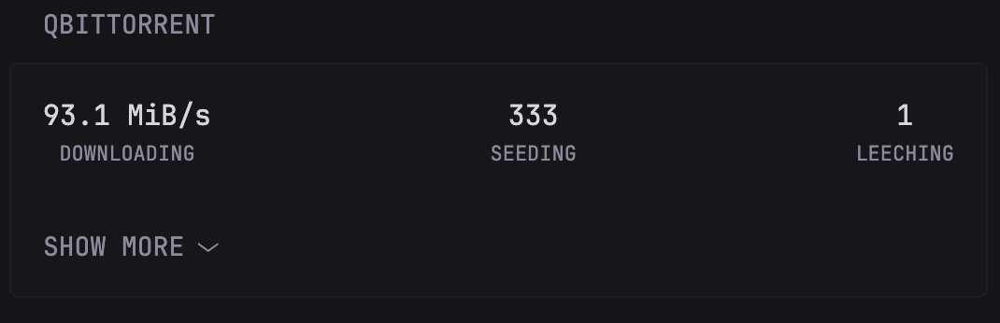
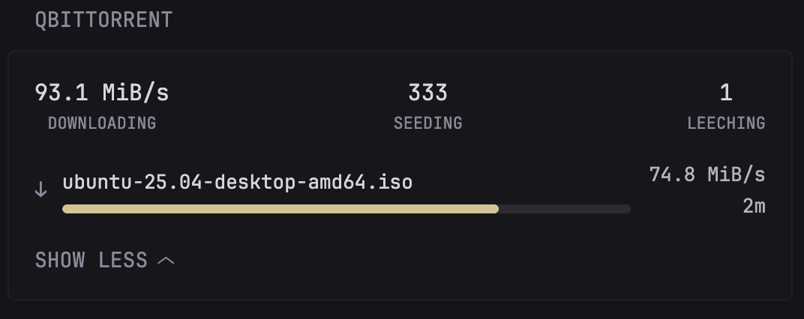
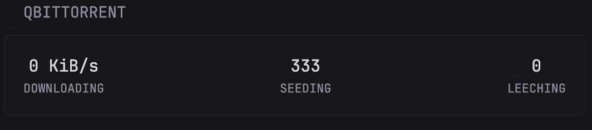
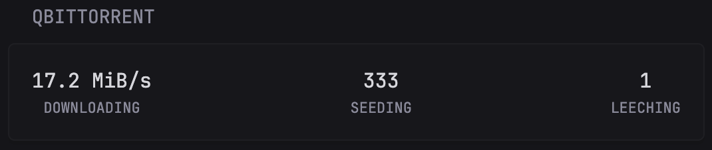
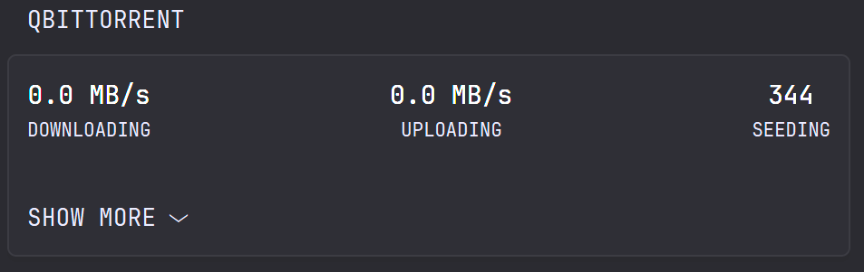

## qBittorrent widget

At-a-***glance*** view your total download speed, and the number of torrents currently seeding and leeching.

There are 4 options for this widget:
1. ```view: "detailed"```: with a detailed list for each active torrent currently downloading that shows under the "Show more" button (hidden when there is no active torrents)
2. ```view: "basic"```: just stats from qBittorrent (Current download speed, number of torrents seeding and leeching)
3. ```mode: "default"```: shows current download speed and number of torrents seeding and leeching
4. ```mode: "upload"```: replaces the number of torrents leeching with upload speed, combining with ```view: detailed``` shows the current list of torrents seeding

### Prerequisites (Required)

This widget requires you to bypass authentication for your Glance dashboard within qBittorrent's settings. This allows Glance to securely access the API without needing to handle a complex login process or wrapper.

1. Open the qBittorrent Web UI.

2. Go to Tools -> Options -> Web UI.

3. Under the Authentication section, check the box for "Bypass authentication for clients in whitelisted IP subnets".

4. In the text box, add the IP address or subnet of where **Glance** is running. For example, if your entire local network is ```192.168.1.x```, you can add ```192.168.1.0/24```.
     -  **Note for Docker Users:** If you are running Glance in a Docker container (not using ```network_mode: host```), qBittorrent will see requests coming from Docker's internal IP address. You must whitelist your Docker network's subnet. Here’s how to find the right one:

          1. Find your Docker network name.
          Open a terminal on your Docker host and run ```docker network ls```. This will list all available networks.
          
                - If you are using Docker Compose, the network name is often formatted as ```<your_stack_name>_default``` (e.g., ```media-stack_default```).
          
               - If you are not using Compose, you are likely on the default ```bridge``` network.
     
          2. Inspect the network to find its subnet.
          Run ```docker network inspect <your_network_name>```, replacing ```<your_network_name>``` with the name you found in the previous step.
          
               - For a Compose stack named ```media-stack```: ```docker network inspect media-stack_default```
               
               - For the default network: ```docker network inspect bridge```: Look for the "Subnet" value in the output. It will look something like ```172.18.0.0/16```.
              
             > **Note:** A special thanks to user **wash** on discord for providing the fix for Docker Compose network setups.

5. Click Save.

### Setup
The widget uses an environment variable to know where to find your qBittorrent server.

You must define QBITTORRENT_IP in your environment. **Important: Do not include http:// in the value.**

- Variable: ```QBITTORRENT_IP```

- Example Value: ```192.168.1.8:8080```

If you don't want to use environment variables, you can just hard code your ip adress directly in the widget by replacing the ```${QBITTORRENT_URL}``` with your qBittorrent IP.

### Detailed View
Use ```view: "detailed"``` in ```options```to get the detailed view

 
 
 

### Basic View
Use ```view: "basic"``` in ```options```to get the basic view

 

### Mode: Default
Use ```mode: "default"``` in ```options```to get the default mode


### Mode: Upload
Use ```mode: "upload"``` in ```options```to get the upload mode



Once the prerequisites and setup are complete, copy the code below and add it to your ```glance.yml``` file.

```yaml
- type: custom-api
  title: qBittorrent
  cache: 10s
  options:
    view: "detailed"   # "basic" or "detailed"
    mode: "upload"    # "default" or "upload"
  subrequests:
    transfer:
      url: http://${QBITTORRENT_IP}/api/v2/transfer/info
    seeding:
      url: http://${QBITTORRENT_IP}/api/v2/torrents/info
      parameters:
        filter: seeding
    leeching:
      url: http://${QBITTORRENT_IP}/api/v2/torrents/info
      parameters:
        filter: downloading
  template: |
    {{ $transfer := .Subrequest "transfer" }}
    {{ $seeding := .Subrequest "seeding" }}
    {{ $leeching := .Subrequest "leeching" }}

    {{ if and (eq $transfer.Response.StatusCode 200) (eq $seeding.Response.StatusCode 200) (eq $leeching.Response.StatusCode 200) }}

      {{ $isDetailed := eq (.Options.StringOr "view" "detailed") "detailed" }}
      {{ $mode := .Options.StringOr "mode" "default" }}

      {{ if $isDetailed }}
      <!-- Detailed View -->
      <div class="list" style="--list-gap: 15px;">
        <div class="flex justify-between text-center">
          <div>
            {{ $dlSpeed := $transfer.JSON.Float "dl_info_speed" }}
            {{ if eq $mode "upload" }}
              <div class="color-highlight size-h3">{{ printf "%.1f MB/s" (div $dlSpeed 1000000.0) }}</div>
            {{ else }}
              {{ if lt $dlSpeed 1048576.0 }}
                <div class="color-highlight size-h3">{{ printf "%.0f KiB/s" (div $dlSpeed 1024.0) }}</div>
              {{ else }}
                <div class="color-highlight size-h3">{{ printf "%.1f MiB/s" (div $dlSpeed 1048576.0) }}</div>
              {{ end }}
            {{ end }}
            <div class="size-h6">DOWNLOADING</div>
          </div>

          {{ if eq $mode "upload" }}
          <div>
            {{ $ulSpeed := $transfer.JSON.Float "up_info_speed" }}
            <div class="color-highlight size-h3">{{ printf "%.1f MB/s" (div $ulSpeed 1000000.0) }}</div>
            <div class="size-h6">UPLOADING</div>
          </div>
          {{ end }}

          <div>
            <div class="color-highlight size-h3">{{ len ($seeding.JSON.Array "") }}</div>
            <div class="size-h6">SEEDING</div>
          </div>

          {{ if eq $mode "default" }}
          <div>
            <div class="color-highlight size-h3">{{ len ($leeching.JSON.Array "") }}</div>
            <div class="size-h6">LEECHING</div>
          </div>
          {{ end }}
        </div>

        <!-- Downloading list -->
        {{ $downloadingTorrents := $leeching.JSON.Array "" }}
        {{ if gt (len $downloadingTorrents) 0 }}
          <div style="margin-top: 15px;">
            <ul class="list collapsible-container" data-collapse-after="0" style="--list-gap: 15px;">
              {{ range $t := $downloadingTorrents }}
                {{ $state := $t.String "state" }}
                {{ $icon := "?" }}
                {{ if ge ($t.Int "completed") ($t.Int "size") }}{{ $icon = "✔" }}
                {{ else if eq $state "downloading" "forcedDL" }}{{ $icon = "↓" }}
                {{ else if eq $state "pausedDL" "stoppedDL" "pausedUP" "stalledDL" "stalledUP" "queuedDL" "queuedUP" }}{{ $icon = "❚❚" }}
                {{ else if eq $state "error" "missingFiles" }}{{ $icon = "!" }}
                {{ else if eq $state "checkingDL" "checkingUP" "allocating" }}{{ $icon = "…" }}
                {{ else if eq $state "checkingResumeData" }}{{ $icon = "⟳" }}
                {{ end }}

                <li class="flex items-center" style="gap: 10px;">
                  <div class="size-h4" style="flex-shrink: 0;">{{ $icon }}</div>
                  <div style="flex-grow: 1; min-width: 0;">
                    <div class="text-truncate color-highlight">{{ $t.String "name" }}</div>
                    <div title="{{ $t.Float "progress" | mul 100 | printf "%.1f" }}%" style="background: rgba(128, 128, 128, 0.2); border-radius: 5px; height: 6px; margin-top: 5px; overflow: hidden;">
                      <div style="width: {{ $t.Float "progress" | mul 100 }}%; background-color: var(--color-positive); height: 100%; border-radius: 5px;"></div>
                    </div>
                  </div>
                  <div style="flex-shrink: 0; text-align: right; width: 80px;">
                    {{ $dlSpeed := $t.Float "dlspeed" }}
                    <div class="size-sm color-paragraph">
                      {{ if eq $mode "upload" }}
                        {{ if lt $dlSpeed 1000.0 }}--{{ else }}{{ printf "%.1f MB/s" (div $dlSpeed 1000000.0) }}{{ end }}
                      {{ else }}
                        {{ if lt $dlSpeed 1024.0 }}--{{ else if lt $dlSpeed 1048576.0 }}{{ printf "%.0f KiB/s" (div $dlSpeed 1024.0) }}{{ else }}{{ printf "%.1f MiB/s" (div $dlSpeed 1048576.0) }}{{ end }}
                      {{ end }}
                    </div>
                    {{ $eta := $t.Int "eta" }}
                    <div class="size-sm color-paragraph">
                      {{ if eq $eta 8640000 }}∞
                      {{ else if gt $eta 3600 }}{{ printf "%dh %dm" (div $eta 3600) (mod (div $eta 60) 60) }}
                      {{ else if gt $eta 0 }}{{ printf "%dm" (div $eta 60) }}
                      {{ else }}--{{ end }}
                    </div>
                  </div>
                </li>
              {{ end }}
            </ul>
          </div>
        {{ end }}

        <!-- Seeding list -->
        {{ if eq $mode "upload" }}
          {{ $seedingTorrents := $seeding.JSON.Array "" }}
          {{ if gt (len $seedingTorrents) 0 }}
            <div style="margin-top: 20px;">
              <ul class="list collapsible-container" data-collapse-after="0" style="--list-gap: 15px;">
                {{ range $t := $seedingTorrents }}
                  {{ $state := $t.String "state" }}
                  {{ $icon := "↑" }}
                  {{ if eq $state "pausedUP" "stoppedUP" "stalledUP" "queuedUP" }}{{ $icon = "❚❚" }}
                  {{ else if eq $state "error" "missingFiles" }}{{ $icon = "!" }}
                  {{ else if eq $state "checkingUP" }}{{ $icon = "…" }}
                  {{ else if eq $state "checkingResumeData" }}{{ $icon = "⟳" }}
                  {{ end }}

                  <li class="flex items-center" style="gap: 10px;">
                    <div class="size-h4" style="flex-shrink: 0;">{{ $icon }}</div>
                    <div style="flex-grow: 1; min-width: 0;">
                      <div class="text-truncate color-highlight">{{ $t.String "name" }}</div>
                      <div class="size-sm color-paragraph">
                        Ratio: {{ printf "%.2f" ($t.Float "ratio") }} | 
                        Size: {{ printf "%.1f GB" (div ($t.Float "size") 1073741824.0) }}
                      </div>
                    </div>
                    <div style="flex-shrink: 0; text-align: right; width: 80px;">
                      {{ $ulSpeed := $t.Float "upspeed" }}
                      <div class="size-sm color-paragraph">
                        {{ if lt $ulSpeed 1000.0 }}--{{ else }}{{ printf "%.1f MB/s" (div $ulSpeed 1000000.0) }}{{ end }}
                      </div>
                      <div class="size-sm color-paragraph">Upload</div>
                    </div>
                  </li>
                {{ end }}
              </ul>
            </div>
          {{ end }}
        {{ end }}

      </div>

      {{ else }}
      <!-- Basic View -->
      <div class="flex justify-between text-center">
        <div>
          {{ $dlSpeed := $transfer.JSON.Float "dl_info_speed" }}
          <div class="color-highlight size-h3">{{ printf "%.1f MB/s" (div $dlSpeed 1000000.0) }}</div>
          <div class="size-h6">DOWNLOADING</div>
        </div>
        {{ if eq $mode "upload" }}
        <div>
          {{ $ulSpeed := $transfer.JSON.Float "up_info_speed" }}
          <div class="color-highlight size-h3">{{ printf "%.1f MB/s" (div $ulSpeed 1000000.0) }}</div>
          <div class="size-h6">UPLOADING</div>
        </div>
        {{ end }}
        <div>
          <div class="color-highlight size-h3">{{ len ($seeding.JSON.Array "") }}</div>
          <div class="size-h6">SEEDING</div>
        </div>
        {{ if eq $mode "default" }}
        <div>
          <div class="color-highlight size-h3">{{ len ($leeching.JSON.Array "") }}</div>
          <div class="size-h6">LEECHING</div>
        </div>
        {{ end }}
      </div>
      {{ end }}

    {{ else }}
      <div class="color-negative text-center">
        <p>Error fetching qBittorrent data.</p>
        <p class="size-sm">Check URL and authentication bypass settings.</p>
      </div>
    {{ end }}
```

## Contributions
[@5at0ri](https://github.com/5at0ri) - Upload stats suggestion and code contribution
