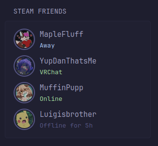

# Steam Users List
A simple widget that can be used to show some basic info about some users on steam

This widget supports up to 100 users everytime its used as per [steam docs](https://developer.valvesoftware.com/wiki/Steam_Web_API#GetPlayerSummaries_(v0002)) and (by default) will be collapsible after 5 users

The widget requires a steam API key which you can get from [here](https://steamcommunity.com/dev/apikey). As for providing user IDs (must be steamID64), they can be done as a comma separated list `&steamids=1,2,3`. You can easily get the IDs using a website like this https://steamid.io/

```yaml
- type: custom-api
  title: Steam Users
  cache: 1m
  url: https://api.steampowered.com/ISteamUser/GetPlayerSummaries/v0002/?key=${STEAM_API_KEY}&steamids=${USER_ID1},${USER_ID2},${USER_ID3}
  template: |
    <ul class="list list-gap-10 collapsible-container" data-collapse-after="5">
      {{ $players := .JSON.Array "response.players" }}
      {{ if gt (len $players) 0 }}
        {{ range $players }}
          {{ $status := .Int "personastate" }}
          {{ $colorClass := "color-subdue" }}
          {{ $statusText := "Offline" }}
          {{ if eq $status 1 }}
            {{ $colorClass = "color-positive" }}
            {{ $statusText = "Online" }}
          {{ else if eq $status 2 }}
            {{ $colorClass = "color-highlight" }}
            {{ $statusText = "Busy" }}
          {{ else if eq $status 3 }}
            {{ $colorClass = "color-primary" }}
            {{ $statusText = "Away" }}
          {{ else if eq $status 4 }}
            {{ $colorClass = "color-primary" }}
            {{ $statusText = "Snooze" }}
          {{ else if eq $status 5 }}
            {{ $colorClass = "color-primary" }}
            {{ $statusText = "Looking to Trade" }}
          {{ else if eq $status 6 }}
            {{ $colorClass = "color-primary" }}
            {{ $statusText = "Looking to Play" }}
          {{ end }}
          <li class="flex gap-10 items-start thumbnail-parent">
            <a href="{{ .String "profileurl" }}" style="width: 4.4rem;height: 4.4rem;border: 2px solid var(--color-text-subdue);padding: 2px;border-radius: 50%;position: relative;flex-shrink: 0;">
              
            </a>
            <div class="items-start">
              <a href="{{.String "profileurl"}}" title="{{.String "personname"}}" class="size-h3 block">{{ .String "personaname" }}</a>
              <span class="{{ $colorClass }}">
                {{ if .Exists "gameextrainfo" }}
                  {{ .String "gameextrainfo" }}
                {{ else }}
                  {{ $statusText }}
                  {{ if eq $status 0 }}
                    {{ if .Exists "lastlogoff" }}
                      for <span data-dynamic-relative-time="{{ .Int "lastlogoff" }}"></span>
                    {{ end }}
                  {{ end }}
                {{ end }}
              </span>
            </div>
          </li>
        {{ end }}
      {{ else }}
        <p class="color-negative">No player data found.</p>
      {{ end }}
    </ul>
```

(im so sorry for the if statement spam lol, I couldnt figure out a better way to do it)