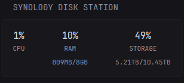

# Synology Disk Station Widget

Displays RAM and CPU usage and used storage of your Synology NAS

## Widget Type
`custom-api`

## Preview



## How to Use
1. Copy the contents of the file below into your glance.yml file. (This works best as a -size: small widget)
2. Replace [username], [password], [IP] and [Port]


```yaml
- type: custom-api
  cache: 5m
  title: Synology Disk Station
  options:
    nas-ip: "[IP]"
    nas-port: "[Port]"
    username: "[username]"
    password: "[password]"
  template: |
    {{ $baseUrl := concat "http://" (.Options.StringOr "nas-ip" "127.0.0.1") ":" (.Options.StringOr "nas-port" "5000") "/webapi/entry.cgi" }}
    {{ $auth := newRequest $baseUrl
        | withParameter "api" "SYNO.API.Auth"
        | withParameter "version" "6"
        | withParameter "method" "login" 
        | withParameter "account" (.Options.StringOr "username" "admin")
        | withParameter "passwd" (.Options.StringOr "password" "admin")
        | withParameter "session" "FileStation" 
        | withParameter "format" "sid" 
        | getResponse
    }}

    {{ $sid := $auth.JSON.String "data.sid" }}
    
    
    {{
      $storage := newRequest $baseUrl
        | withParameter "api" "SYNO.Core.System"
        | withParameter "method" "info"
        | withParameter "type" "storage"
        | withParameter "version" "1"
        | withParameter "_sid" $sid
        | getResponse
    }}
    
    {{
      $cpu := newRequest $baseUrl
        | withParameter "api" "SYNO.Core.System.Utilization"
        | withParameter "method" "get"
        | withParameter "version" "1"
        | withParameter "_sid" $sid
        | getResponse
    }}
    
    {{ if and (eq $storage.Response.StatusCode 200) (eq $cpu.Response.StatusCode 200) }}
      {{ $volInfo := index ($storage.JSON.Array "data.vol_info") 0 }}
      {{ $total := $volInfo.Float "total_size" }}
      {{ $used := $volInfo.Float "used_size" }}
      {{ $storagePercent := mul (div $used $total) 100 | toInt }}
      
      {{ $cpuPercent := $cpu.JSON.Int "data.cpu.user_load" }}
      {{ $ramPercent := $cpu.JSON.Int "data.memory.real_usage" }}
      {{ $ramTotalKB := $cpu.JSON.Float "data.memory.total_real" }}
      {{ $ramUsedKB := mul (div $ramTotalKB 100.0) ($ramPercent | toFloat) }}
      {{ $ramUsedMB := div $ramUsedKB 1000 }}
      {{ $ramUsedGB := div $ramUsedKB 1000000 }}
      {{ $ramTotalGB := div $ramTotalKB 1000000 }}
      
      <div class="flex justify-between text-center">
        <div>
          <div class="size-h3 color-highlight">{{ $cpuPercent }}%</div>
          <div class="size-h6">CPU</div>
        </div>
        <div>
          <div class="size-h3 color-highlight">{{ $ramPercent }}%</div>
          <div class="size-h6">RAM</div>
          <div class="size-h6 margin-top-5">
            {{ if ge $ramUsedGB 1.0 }}
              {{ $ramUsedGB | printf "%.1f" }}GB/{{ $ramTotalGB | printf "%.0f" }}GB
            {{ else }}
              {{ $ramUsedMB | printf "%.0f" }}MB/{{ $ramTotalGB | printf "%.0f" }}GB
            {{ end }}
          </div>
        </div>
        <div>
          <div class="size-h3 color-highlight">{{ $storagePercent }}%</div>
          <div class="size-h6">STORAGE</div>
          <div class="size-h6 margin-top-5">
            {{ div $used 1099511627776 | printf "%.2f" }}TB/{{ div $total 1099511627776 | printf "%.2f" }}TB
          </div>
        </div>
      </div>
    {{ else }}
      <p class="color-negative">Failed to fetch system data</p>
    {{ end }}
```
