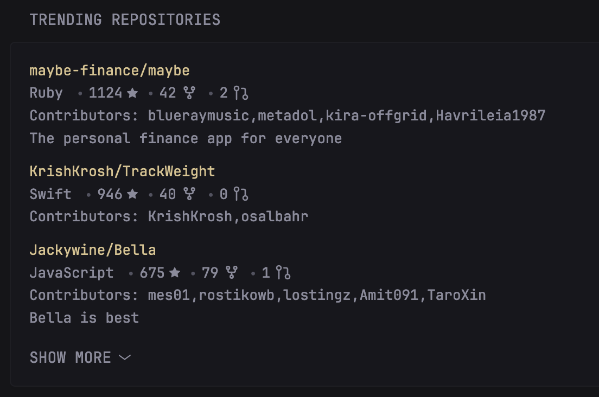

## Preview


The data is sourced from the [OSS Insights](https://ossinsight.io/) trend API, given that no native GitHub trend API exists at the moment. 

```yaml
- type: custom-api
          title: Trending Repositories
          cache: 24h 
          url: 'https://api.ossinsight.io/v1/trends/repos/?period=${PERIOD}&language=${LANGUAGE}'
          template: |
            <ul class="list list-gap-10 collapsible-container" data-collapse-after="3">
              {{ range .JSON.Array "data.rows"}}
                <li>
                  <a class="color-primary-if-not-visited" href="https://github.com/{{ .String "repo_name" }}">{{ .String "repo_name" }}</a> 
                  <ul class="list-horizontal-text">
                      <li class="color-highlight"> {{.String "primary_language"}} </li>

                      <li style="display: flex; align-items: center;gap: 4px;">
                        {{ .Int "stars" }}
                        <svg xmlns="http://www.w3.org/2000/svg" width="10" height="10" fill="currentColor" viewBox="0 0 16 16" aria-hidden="true" focusable="false">
                          <path d="M3.612 15.443c-.386.198-.824-.149-.746-.592l.83-4.73L.173 6.765c-.329-.314-.158-.888.283-.95l4.898-.696L7.538.792c.197-.39.73-.39.927 0l2.184 4.327 4.898.696c.441.062.612.636.282.95l-3.522 3.356.83 4.73c.078.443-.36.79-.746.592L8 13.187l-4.389 2.256z"/>
                        </svg>
                      </li>

                      <li style="display: flex; align-items: center;gap: 4px;">
                        {{ .Int "forks" }}
                        <svg xmlns="http://www.w3.org/2000/svg" width="16" height="16" viewBox="0 0 24 24" fill="none" stroke="currentColor" stroke-width="2" stroke-linecap="round" stroke-linejoin="round" aria-hidden="true" focusable="false">
                          <path stroke="none" d="M0 0h24v24H0z" fill="none"/>
                          <circle cx="12" cy="18" r="2" />
                          <circle cx="7" cy="6" r="2" />
                          <circle cx="17" cy="6" r="2" />
                          <path d="M7 8v2a2 2 0 0 0 2 2h6a2 2 0 0 0 2 -2v-2" />
                          <path d="M12 12l0 4" />
                        </svg>
                      </li>

                      <li style="display: flex; align-items: center;gap: 4px;">
                        {{ .Int "pull_requests" }}
                        <svg xmlns="http://www.w3.org/2000/svg" width="16" height="16" viewBox="0 0 24 24" fill="none" stroke="currentColor" stroke-width="2" stroke-linecap="round" stroke-linejoin="round" aria-hidden="true" focusable="false">
                          <circle cx="6" cy="6" r="3"></circle>
                          <circle cx="18" cy="18" r="3"></circle>
                          <path d="M13 6h3a2 2 0 0 1 2 2v7"></path>
                          <line x1="6" y1="9" x2="6" y2="21"></line>
                        </svg>
                      </li>

                  </ul>
                  <ul class="list collapsible-container">
                    <li style="white-space: nowrap; overflow: hidden; text-overflow: ellipsis;" class="color-subdue">
                      Contributors: {{ .String "contributor_logins"}}
                    </li>
                    <li>
                      {{ .String "description" }}
                    </li>
                  </ul>
                </li>
              {{ end }}
            </ul>
```

## Environment Variables
- `PERIOD` - Period over which the trend is calculated, possible options are [`past_24_hours`, `past_week`, `past_month`, `past_3_months`]
- `LANGUAGE` - The main language used in the repository, possiblities are  [`All`, `JavaScript`, `Java`, `Python`, `PHP`, `C++`, `C#`, `TypeScript`, `Shell`, `C`, `Ruby`, `Rust`, `Go`, `Kotlin`, `HCL`, `PowerShell`, `CMake`, `Groovy`, `PLpgSQL`, `TSQL`, `Dart`, `Swift`, `HTML`, `CSS`, `Elixir`, `Haskell`, `Solidity`, `Assembly`, `R`, `Scala`, `Julia`, `Lua`, `Clojure`, `Erlang`, `Common Lisp`, `Emacs Lisp`, `OCaml`, `MATLAB`, `Objective-C`, `Perl`, `Fortran`]

For any further changes consult the [API's documentation](https://ossinsight.io/docs/api/list-trending-repos). 