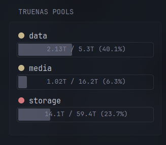

# TrueNAS Scale Pools Widget

This widget features display of TrueNAS Scale datasets with usage and health status.

## Preview


## Env variables
* `TRUENAS_HOST`: HTTP host of your TrueNAS server
* `TRUENAS_API_KEY`: API key (available under Settings->API Keys)

## Code
```yaml
- type: custom-api
  title: TrueNAS Pools
  cache: 1m
  template: |             
    {{
      $dataset := newRequest "${TRUENAS_HOST}/api/v2.0/pool/dataset"
        | withHeader "Authorization" "Bearer ${TRUENAS_API_KEY}"
        | getResponse
    }}
    {{
      $pool := newRequest "${TRUENAS_HOST}/api/v2.0/pool"
        | withHeader "Authorization" "Bearer ${TRUENAS_API_KEY}"
        | getResponse
    }}

    {{ range $dataset.JSON.Array "" }}
      {{ if not (findMatch "/" (.String "name")) }}

        {{ $used := .Float "used.parsed" }}
        {{ $available := .Float "available.parsed" }}
        {{ $total := add $used $available }}

        {{ $totalTb := div (div (div (div $total 1024) 1024) 1024) 1024 | printf "%.1f" }}

        {{ $percent := mul (div $used $total) 100 | printf "%.1f" }}

        {{ $searchString := printf "..#.#(name==\"%s\").healthy|0" (.String "name") }}
        {{ $healthy := $pool.JSON.Bool $searchString }}

        <div style="margin-bottom: 1rem;">
          <div class="color-highlight size-h3">
            {{ if $healthy }}
              <span style="display: inline-block; background-color: var(--color-positive); width: 12px; height: 12px; border-radius: 50%;"></span>
            {{ else }}
              <span style="display: inline-block; background-color: var(--color-negative); width: 12px; height: 12px; border-radius: 50%;"></span>
            {{ end }}
            <span>{{ .String "name" }}</span>
          </div>

          <div class="progress-bar progress-bar-combined" style="position: relative;">
            <div class="flex justify" style="position: absolute; width: 100%; justify-content: center;">
              <span>{{ .String "used.value" }} / {{ $totalTb }}T ({{ $percent }}%)</span>
            </div>
            <div class="progress-value" style="--percent: {{ $percent }}"></div>
          </div>
        </div>

      {{ end }}
    {{ end }}
```