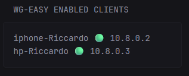

# WG-Easy Enabled Clients

A glance custom widget that shows all enabled and disabled VPN endpoint clients from the WG-Easy web interface.
Here is a preview.



```yaml
- type: custom-api
  title: WG-Easy Enabled Clients
  cache: 5m
  url: https://${WG_EASY_URL}/api/client
  headers:
    Authorization: Basic ${WG_EASY_KEY}
    Accept: application/json
  template: |
    {{ $clients := .JSON.Array "" }}

    <div>
        <!-- List enabled clients -->
        {{ range $client := $clients }}
        <div class="flex flex-col p-2 border rounded">
            <div class="size-h4 font-bold">
            {{ $client.String "name" }}
            {{ if $client.Bool "enabled" }} 
                <span class="text-green-500"> 🟢</span>
            {{ else }}
                <span class="text-gray-400">🔴</span>
            {{ end }}
            {{ $client.String "ipv4Address" }}
            </div>
        </div>
        {{ end }}
    </div>
```

### Environment Variables

- `WG_EASY_URL` - The URL of the WG-Easy Web Page
- `WG_EASY_KEY` - The base64 encoding of `username:password`

You can obtain the encoding like this:

```bash
$ echo "username:password" | base64
```

Or, you go directly to: https://it-tools.tech/base64-string-converter