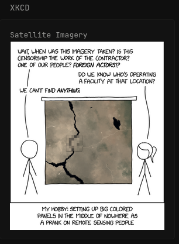

# xkcd Display
Simple custom-api widget to display current xkcd comic

**xkcd**
```
- type: custom-api
  title: xkcd
  cache: 2m
  url: https://xkcd.com/info.0.json
  template: | 
    <body> {{ .JSON.String "title" }}</body>
    </img>
```
